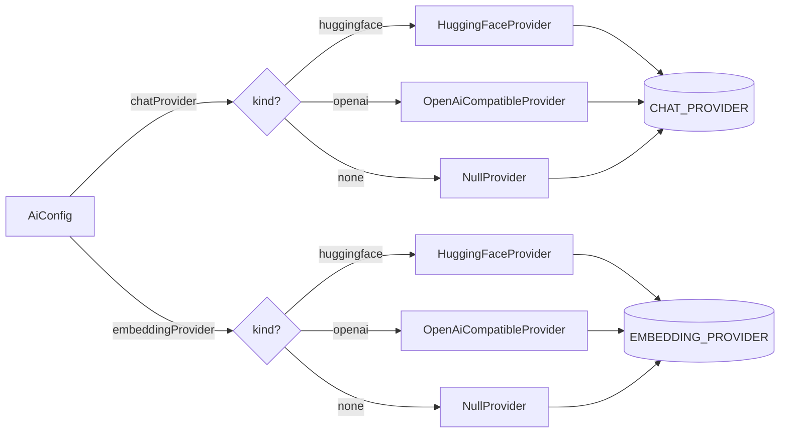
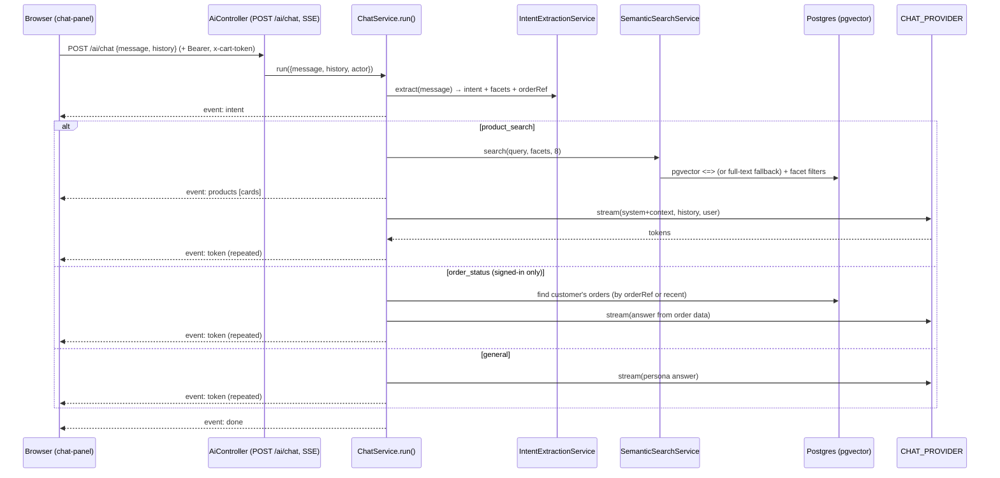
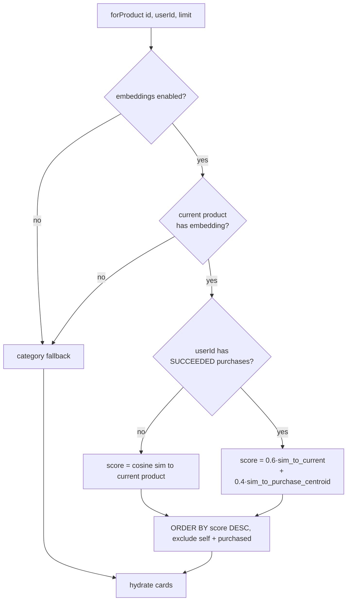

# AI Features

The store ships two AI features — a **streaming chat assistant** and **"You might also like"
product recommendations** — on top of a **pluggable provider abstraction**. Every provider is
optional: with nothing configured the chat falls back to full-text search + templated answers
and recommendations fall back to category browsing, so the app always works.

Backend code lives in [`backend/src/ai`](../backend/src/ai); the provider abstraction is
[`backend/src/ai/providers`](../backend/src/ai/providers) and selection happens in
[`backend/src/ai/ai.module.ts`](../backend/src/ai/ai.module.ts). Frontend:
[`frontend/src/components/ai/chat-panel.tsx`](../frontend/src/components/ai/chat-panel.tsx),
[`frontend/src/lib/ai.ts`](../frontend/src/lib/ai.ts), and
[`frontend/src/components/store/recommendations.tsx`](../frontend/src/components/store/recommendations.tsx).

## Provider abstraction

Two narrow interfaces decouple every AI service from any specific model vendor
([`providers/types.ts`](../backend/src/ai/providers/types.ts)):

| Interface | Methods | Used by |
| --- | --- | --- |
| `ChatProvider` | `isConfigured()`, `complete(messages, opts)`, `stream(messages, opts)` | intent extraction, chat answers |
| `EmbeddingProvider` | `isConfigured()`, `embed(texts) → number[][]`, `dimension` | product/query embeddings |

Services depend on the two DI tokens `CHAT_PROVIDER` and `EMBEDDING_PROVIDER` (symbols), never on
a concrete class. Three implementations satisfy these interfaces:

| Provider | File | Chat transport | Embedding transport | "Configured" when |
| --- | --- | --- | --- | --- |
| **HuggingFace** | [`huggingface.provider.ts`](../backend/src/ai/providers/huggingface.provider.ts) | native Inference API `POST /models/{chatModel}` (text-generation / TGI) | `POST /models/{embeddingModel}/pipeline/feature-extraction` (TEI) | `HF_API_KEY` set |
| **OpenAI-compatible** | [`openai-compatible.provider.ts`](../backend/src/ai/providers/openai-compatible.provider.ts) | `POST /chat/completions` | `POST /embeddings` | `OPENAI_BASE_URL` set |
| **None (null)** | [`null.provider.ts`](../backend/src/ai/providers/null.provider.ts) | — (no tokens) | — (empty vectors) | never (`isConfigured()` is always `false`) |

Notes on the real implementations:

- **HuggingFace** renders `ChatMessage[]` into a single `System / User: / Assistant:` prompt
  string, sets `wait_for_model: true`, and floors temperature at `0.01` on `complete()`
  (`Math.max(temperature ?? 0.2, 0.01)`) because the TGI API rejects `temperature: 0`. The
  explicit `/pipeline/feature-extraction` task makes sentence-transformers models return sentence
  embeddings on both `api-inference.huggingface.co` and the HF router. It implements **both**
  `ChatProvider` and `EmbeddingProvider`.
- **OpenAI-compatible** works with any OpenAI-shaped server (vLLM, TGI `/v1`, Ollama, TEI, the HF
  router). Streaming reads SSE frames and stops on the `[DONE]` sentinel; non-JSON keep-alive
  frames are ignored. `complete()` passes `response_format: { type: 'json_object' }` when
  `options.json` is set. Embeddings are re-sorted by the response `index` before being returned.
  The `authorization` header is only sent when an API key is present (so keyless local servers
  work).
- Both streaming providers parse the response body with the shared
  [`readSseData`](../backend/src/ai/providers/sse.ts) generator, which buffers the fetch stream and
  yields each `data:` payload on `\n\n` frame boundaries.
- **Null** is the fallback when nothing is configured. Its `isConfigured()` returns `false`, which
  every AI service checks before calling the model — see [Graceful degradation](#graceful-degradation).

### Selection by environment

The module factory ([`ai.module.ts`](../backend/src/ai/ai.module.ts)) builds the two providers
**independently** from `AiConfig` ([`configuration.ts`](../backend/src/config/configuration.ts)),
so chat and embeddings can use different vendors (e.g. an OpenAI-compatible chat server with
HuggingFace embeddings):



The embedding **dimension** (`AI_EMBEDDING_DIM`, default **384**) is injected into whichever
embedding provider is built and is exposed as `provider.dimension`. It must match the `bge-small`
model family (`BAAI/bge-small-en-v1.5`, 384 dims) and the database `embedding Unsupported("vector(384)")`
column — see [catalog.md](./catalog.md). Changing the model to a different dimension means changing
both the env var and the column type.

## Chat assistant

The assistant is a floating panel on the storefront. A query flows through LLM intent extraction,
optional semantic retrieval, and a streamed answer, all over a single SSE response.



### SSE event protocol

`run()` is an async generator yielding `ChatEvent`s; the controller serializes each as
`data: <json>\n\n` ([`chat.service.ts`](../backend/src/ai/chat.service.ts),
[`ai.controller.ts`](../backend/src/ai/ai.controller.ts)):

| Event | Shape | Meaning |
| --- | --- | --- |
| `intent` | `{ type, intent }` | The classified intent (`product_search` / `order_status` / `general`). Emitted first. |
| `products` | `{ type, products: ProductCard[] }` | Retrieved product cards (id, name, slug, brand, cheapest price, image). Only for `product_search`. |
| `token` | `{ type, value }` | A chunk of the answer text. Emitted repeatedly as the model streams (or once for a fallback). |
| `done` | `{ type }` | Terminal event; always emitted (in `run()`'s `finally`). |
| `error` | `{ type, message }` | A user-safe error string; the stream still ends with `done`. |

`POST /ai/chat` is a `@Public()` route, so guests can chat. The controller writes the SSE stream
manually (`res.write`), sets `Content-Type: text/event-stream`, and guards every write with a
**client-disconnect flag**: `req.on('close')` sets `closed`, and the loop breaks / `send()` no-ops
once the client is gone or `res.writableEnded`. The request body is validated by
[`dto/chat.dto.ts`](../backend/src/ai/dto/chat.dto.ts) (`message` ≤ 2000 chars, optional `history`
of `{role: user|assistant, content ≤ 4000}`).

### Intent + facet extraction

[`IntentExtractionService.extract`](../backend/src/ai/intent-extraction.service.ts) asks the chat
provider (with `json: true, temperature: 0`) to return a strict JSON object:

```json
{ "intent": "product_search|order_status|general",
  "query": "concise search phrase",
  "facets": { "category", "color", "style", "useCase", "priceMin", "priceMax" },
  "orderRef": "ORD-… or null" }
```

The raw response is parsed by slicing from the first `{` to the last `}` (tolerant of prose around
the JSON) and normalized (unknown intent → `product_search`, missing query → the raw message).
`priceMin`/`priceMax` are **in dollars**. If no chat model is configured or extraction throws, a
**heuristic fallback** runs: an `ORD-…` regex or order/tracking/status keywords ⇒ `order_status`
(capturing any order ref), otherwise `product_search` with empty facets.

### The three intents

- **`product_search`** — runs semantic search (below), emits a `products` event, then streams an
  answer grounded in those cards. If zero products match, it emits a single "couldn't find
  anything" token and skips the model. The answer prompt instructs the model to recommend **only**
  from the supplied list and never invent products or prices.
- **`order_status`** — **signed-in customers only**. If `request.actor` is absent (a guest), the
  assistant replies with a single token: *"Please sign in to your account so I can look up your
  orders."* For an authenticated customer it queries that customer's orders
  (`customerId = actor.id`), narrowed to one order when an `orderRef` was extracted, else the 3
  most recent, and streams an answer built **only** from that order data (number, status,
  fulfillment, total). See [orders.md](./orders.md).
- **`general`** — streams a short persona reply that steers back to shopping help.

### Semantic search

[`SemanticSearchService.search`](../backend/src/ai/semantic-search.service.ts) turns a query +
hard facets into ranked product IDs, then hydrates them into cards:

1. **Build facet filters** as raw SQL `AND` fragments: `category` matches the category or its
   parent department by `ILIKE`; `priceMin`/`priceMax` are `EXISTS` checks against
   `product_variants.priceAmount` (dollars → cents). These are **hard filters** applied to both
   retrieval paths.
2. **Vector path** (when embeddings are enabled): embed `query + color + style + useCase`, then
   `ORDER BY p.embedding <=> $vector::vector LIMIT n` (pgvector cosine distance) over `ACTIVE`,
   non-deleted products with a non-null embedding, plus the facet filters.
3. **Full-text fallback** (no embeddings, or the query didn't embed): OR-match the salient words
   (`to_tsquery('english', 'a | b | c')`, up to 8 words) against the maintained `searchVector`,
   ranked by `ts_rank`. OR-matching is deliberate — `websearch_to_tsquery`'s implicit AND would
   return nothing for a natural-language sentence. If there are no salient words or no matches, it
   returns the most recent in-scope products so the assistant still shows something.
4. **Hydrate** the resulting IDs (preserving rank order) with category, first image, and
   price-ascending variants.

### Streaming the answer

[`ChatService.answer`](../backend/src/ai/chat.service.ts) is the single funnel for all three
intents. If the chat provider is **not** configured it yields one `token` from the intent-specific
fallback (e.g. *"Here are a few options you might like: …"*). Otherwise it streams the model at
`temperature: 0.4`; if the stream produces no tokens, or throws mid-flight, it degrades to the same
templated fallback rather than failing.

## "You might also like" recommendations

`GET /ai/recommendations/:productId` ([`recommendations.service.ts`](../backend/src/ai/recommendations.service.ts))
returns products similar to the one being viewed, personalized toward the signed-in customer's
purchase history.



- **Similarity** uses cosine similarity `1 - (embedding <=> current::vector)` against all `ACTIVE`,
  non-deleted, embedded products.
- **Purchase-history personalization**: the customer's purchased products (order items on orders
  with `paymentStatus = SUCCEEDED`) form a **centroid** via `avg(embedding)`. The score becomes a
  60/40 blend of similarity to the current product and similarity to that centroid — nudging
  results toward the customer's taste.
- **Exclusions**: the current product and everything the customer already bought are excluded.
- **Category fallback** (no embeddings, current product unembedded, or the embedding query throws):
  broaden to the **whole department** — sibling categories under the same parent (or the category
  itself if it has no parent) — newest first, then **top up** with other recent active products so
  the list is always filled to `limit`.
- The embedding path is wrapped in `try/catch`; any failure logs and **degrades** to the category
  fallback rather than erroring the request.

### Frontend gating

[`Recommendations`](../frontend/src/components/store/recommendations.tsx) renders the "You might
also like" section **only for logged-in customers**: it reads `user.role` from the auth provider,
returns `null` unless the role is `CUSTOMER`, and only enables the query in that case
([`use-recommendations.ts`](../frontend/src/hooks/use-recommendations.ts) passes `enabled`). It also
hides itself when the result is empty. Guests and admins never see it or fire the request.

## Graceful degradation

With `AI_CHAT_PROVIDER=none` and `AI_EMBEDDING_PROVIDER=none` (the defaults), the `NullProvider`
reports `isConfigured() === false` and every feature still functions:

| Capability | With a model | With no model |
| --- | --- | --- |
| Intent classification | LLM JSON extraction | regex/keyword heuristic |
| Product retrieval | pgvector ANN nearest-neighbour | Postgres full-text (`searchVector`) |
| Chat answer | streamed model tokens | one templated token (top products / order summary / prompt) |
| Recommendations | embedding similarity + purchase centroid | department/category fallback fill |

The chat assistant and recommendations therefore remain usable for local development and for
deployments that choose not to run a model — no feature flag, no dead UI.

## How embeddings are generated

Products are embedded by [`EmbeddingService.embedProduct`](../backend/src/ai/embedding.service.ts),
which is a **no-op unless an embedding model is configured**. It composes a text blob from the
product's name, brand, category, description, and attributes, calls the provider, and writes the
result to `embedding vector(384)` plus `embeddingModel` and `indexedAt` via raw SQL (Prisma can't
type the pgvector column). This runs as the second half of the catalog reindex pipeline — every
product create/update enqueues a reindex, and `POST /admin/catalog/reindex` backfills all products.
See the indexing flow in [catalog.md](./catalog.md).

`embedQuery` is the read-side counterpart used by chat and search; it returns `null` (not an error)
when AI is disabled or the text is blank, which is how the retrieval services choose the full-text
path.

### ANN index

Vector search and recommendations rely on a pgvector **HNSW** index that Prisma can't express, so it
is applied manually after embeddings are populated
([`prisma/sql/ai-indexes.sql`](../backend/prisma/sql/ai-indexes.sql)):

```sql
CREATE INDEX IF NOT EXISTS products_embedding_hnsw
  ON products USING hnsw (embedding vector_cosine_ops);
```

`vector_cosine_ops` matches the `<=>` cosine-distance operator used in the queries. Run it once
(e.g. `psql "$DATABASE_URL" -f prisma/sql/ai-indexes.sql`) after configuring a model and reindexing.

## AI environment variables

All read in [`configuration.ts`](../backend/src/config/configuration.ts) under the `ai` key.

| Variable | Default | Purpose |
| --- | --- | --- |
| `AI_CHAT_PROVIDER` | `none` | Chat provider: `huggingface` \| `openai` \| `none`. |
| `AI_EMBEDDING_PROVIDER` | `none` | Embedding provider (selected independently of chat). |
| `AI_EMBEDDING_DIM` | `384` | Embedding dimension; must equal the model's and the `vector(384)` column. |
| `AI_MAX_CONTEXT_PRODUCTS` | `8` | Max products fed into chat context. |
| `HF_API_KEY` | `''` | HuggingFace token; presence makes the HF provider "configured". |
| `HF_BASE_URL` | `https://api-inference.huggingface.co` | HF Inference API / router base URL. |
| `HF_CHAT_MODEL` | `meta-llama/Llama-3.1-8B-Instruct` | HF text-generation model. |
| `HF_EMBEDDING_MODEL` | `BAAI/bge-small-en-v1.5` | HF feature-extraction model (384-dim). |
| `OPENAI_API_KEY` | `''` | Bearer for the OpenAI-compatible server (optional for keyless local servers). |
| `OPENAI_BASE_URL` | `http://localhost:8000/v1` | OpenAI-compatible base URL; presence makes the provider "configured". |
| `OPENAI_CHAT_MODEL` | `meta-llama/Llama-3.1-8B-Instruct` | Chat-completions model name. |
| `OPENAI_EMBEDDING_MODEL` | `BAAI/bge-small-en-v1.5` | `/embeddings` model name (384-dim). |

## Related

- Embedding generation, the reindex pipeline, `searchVector`, and the `vector(384)` column →
  [catalog.md](./catalog.md).
- Order lookup behind the `order_status` intent (statuses, fulfillment) → [orders.md](./orders.md).
