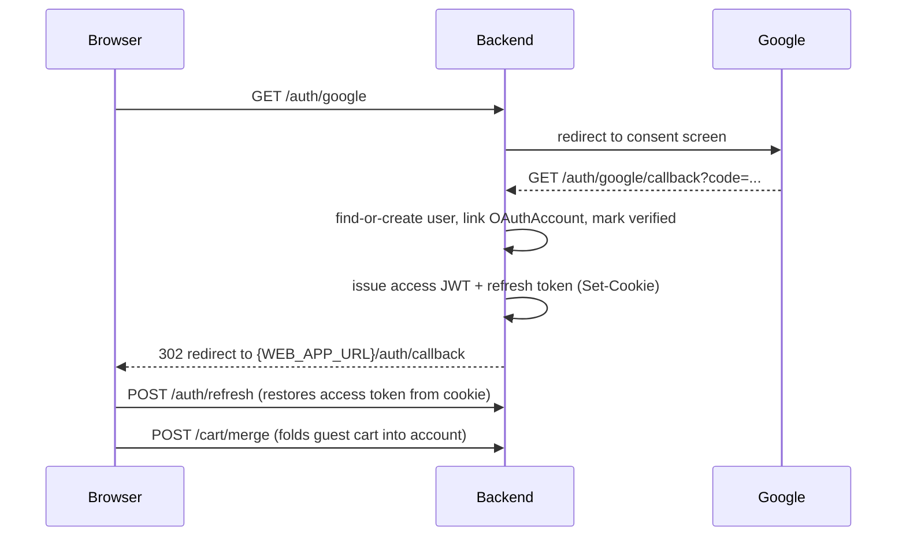
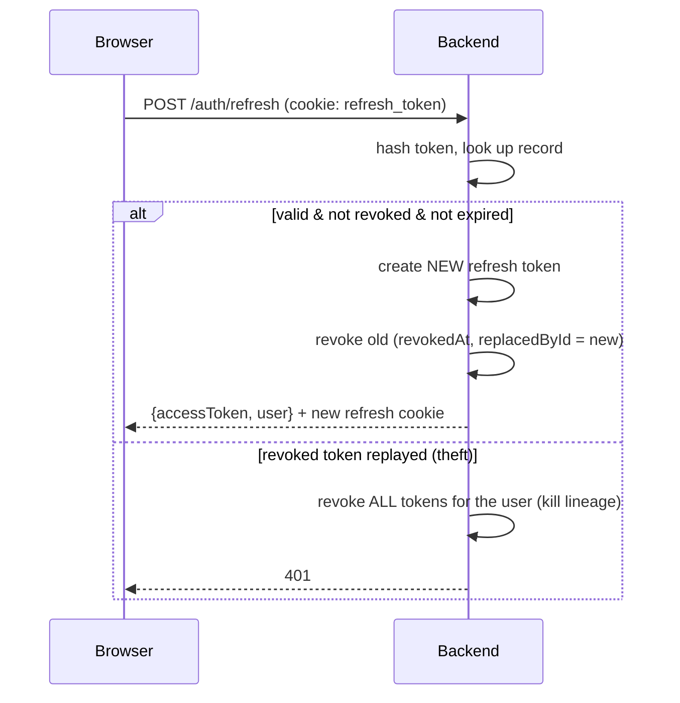

# Authentication & Authorization

Two sign-in methods (email/password and Google OAuth) feed a single session model:
**short-lived JWT access tokens + long-lived opaque, rotating refresh tokens**. Roles
(`GUEST`, `CUSTOMER`, `ADMIN`) gate every route through global guards.

Backend code lives in [`backend/src/auth`](../backend/src/auth) and
[`backend/src/common/guards`](../backend/src/common/guards); the frontend client is
[`frontend/src/lib/api.ts`](../frontend/src/lib/api.ts) and
[`frontend/src/providers/auth-provider.tsx`](../frontend/src/providers/auth-provider.tsx).

## Token model

| Token | Lifetime | Storage | Transport |
| --- | --- | --- | --- |
| **Access** (JWT) | short (`JWT_ACCESS_TTL`, default 15 min) | in-memory on the client | `Authorization: Bearer` header |
| **Refresh** (opaque) | long (`REFRESH_TOKEN_TTL_DAYS`, default 30 days) | **SHA-256 hash** in `refresh_tokens` | `httpOnly` cookie |

- The access JWT payload is `{ sub: userId, email, role }`, signed with `JWT_ACCESS_SECRET`.
- The refresh token is 48 bytes of CSPRNG randomness (`generateOpaqueToken`). The raw value
  is only ever in the cookie; the DB stores `sha256(token)` so a DB leak can't reuse it.
- The refresh cookie is `httpOnly`, `sameSite=lax`, `secure` in production, scoped to `/`.
- `TokenService` (`token.service.ts`) issues, rotates, and revokes; `AuthService`
  (`auth.service.ts`) owns credential/OAuth/verification logic.

## Registration + email verification

```mermaid
sequenceDiagram
  participant U as User
  participant API as Backend
  participant M as Mailer (queue)
  U->>API: POST /auth/register {email,password,name}
  API->>API: reject if email exists
  API->>API: create User (CUSTOMER, emailVerifiedAt=null)
  API->>API: create VerificationToken (sha256, 24h, EMAIL_VERIFICATION)
  API->>M: enqueue verification email (link with raw token)
  API-->>U: "Check your email to verify"
  U->>API: POST /auth/verify-email {token}
  API->>API: atomically consume token (single-use)
  API->>API: set emailVerifiedAt; activate if INVITED
  API-->>U: "Email verified, you can sign in"
```

- The password is hashed with **argon2id** before storage.
- Verification tokens are single-use: consumption is an atomic conditional `updateMany`
  (`consumedAt IS NULL AND expiresAt > now`), so concurrent redemptions can't double-spend.
- An unverified account exists but **cannot log in** — `validateCredentials` rejects until
  `emailVerifiedAt` is set.
- Verifying never resurrects a `SUSPENDED`/`DEACTIVATED` account (it only activates `INVITED`).

## Credential login

```mermaid
sequenceDiagram
  participant U as Browser
  participant API as Backend
  U->>API: POST /auth/login {email,password} (+ x-cart-token if guest)
  API->>API: argon2.verify; require verified + active account
  API->>API: merge guest cart into the user account
  API->>API: issue access JWT + create refresh token
  API-->>U: 200 {accessToken, user} + Set-Cookie: refresh_token (httpOnly)
```

- On success the guest cart (identified by the `x-cart-token` header) is folded into the
  user's cart (`CartService.mergeGuestCartIntoUser`).
- Generic `Invalid email or password` errors avoid revealing which emails exist.

## Google OAuth



- `findOrCreateGoogleUser` links by `(provider, providerAccountId)` and upserts by email;
  Google accounts are treated as email-verified.
- The OAuth redirect can't carry the cart header, so the frontend calls `POST /cart/merge`
  after the session is restored on `/auth/callback`.
- When Google credentials aren't configured, the strategy boots with placeholders and only
  fails at the actual Google handshake — the rest of the app runs.

## Refresh-token rotation & reuse detection



- **Every** refresh rotates the token (single-use). The old one is revoked and points at its
  replacement via `replacedById`.
- If a token that's already revoked is presented again, that's a replay of a stolen token —
  the whole user's token lineage is revoked, forcing a fresh login everywhere.

## Logout & password reset

- **Logout** (`POST /auth/logout`): revokes the presented refresh token and clears the cookie.
- **Forgot** (`POST /auth/password/forgot`): always returns success (no user enumeration);
  emails a reset token (1 h TTL) only if the account has a password.
- **Reset** (`POST /auth/password/reset`): consumes the token, updates the argon2 hash, and
  **revokes every existing session** (`revokeAllForUser`) so a stolen refresh token can't
  survive the reset. The new password is strength-validated (8–72 chars).

## Authorization

Three global guards run in order on every request
([`app.module.ts`](../backend/src/app.module.ts)):

1. **`ThrottlerGuard`** — rate limiting (120 req / 60 s by default).
2. **`JwtAuthGuard`** — validates the bearer JWT. On `@Public()` routes a missing/invalid
   token is allowed through but a *valid* one is still decoded and attached (so public
   endpoints can personalize). `JwtStrategy.validate` reloads the user and rejects
   suspended/deleted accounts.
3. **`RolesGuard`** — enforces `@Roles(...)` metadata against `user.role`.

| Decorator | Effect |
| --- | --- |
| `@Public()` | No auth required (token attached if present). |
| `@Roles(Role.ADMIN)` | Caller must have the listed role(s). |
| `@CurrentUser()` | Injects `{ id, email, role }` of the authenticated user. |

Role meaning:
- **GUEST** — unauthenticated; can browse catalog, hold a guest cart, and check out.
- **CUSTOMER** — owns an account, order history, and personalized AI recommendations.
- **ADMIN** — full catalog/order/customer management and dashboard.

Routes default to **deny** — a route is only reachable without a role if it's `@Public()`.

## Frontend session handling

- The access token is held **in memory only** (`api.ts`); it is never persisted, so XSS can't
  read it from storage.
- An axios response interceptor performs a **single-flight** `/auth/refresh` on `401` and
  retries the original request once; concurrent 401s share one refresh round-trip.
- `AuthProvider` restores the session on app load by calling `/auth/refresh` (the cookie is
  the durable credential).
- `RequireAuth` (`components/route-guards.tsx`) gates routes by authentication and role,
  redirecting unauthenticated users to `/login` and wrong-role users to `/`.

## Security properties (summary)

- argon2id password hashing; opaque refresh tokens stored only as SHA-256 hashes.
- Single-use rotating refresh tokens with stolen-token lineage revocation.
- Email-verification gate before login; password reset invalidates all sessions.
- No user enumeration on login / forgot-password / resend-verification.
- `httpOnly` refresh cookie (not reachable from JS); access token in memory only.
- Production refuses to boot with the default `JWT_ACCESS_SECRET`.
- Global rate limiting on all routes.
