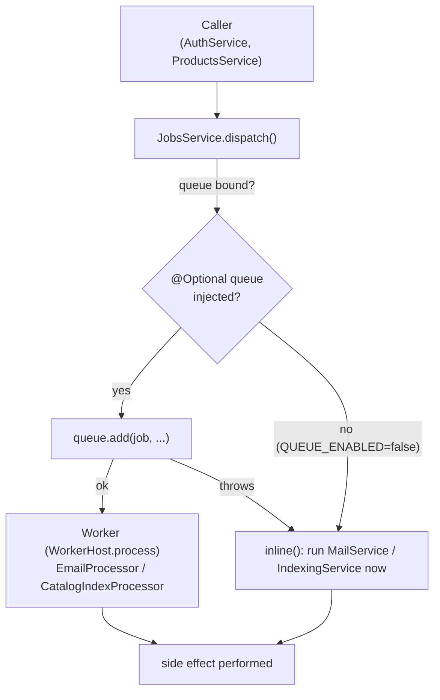
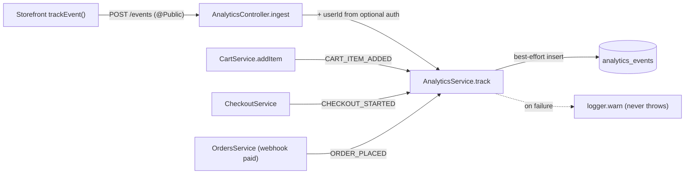

# Background Jobs, Schedulers, Analytics & Observability

Everything that runs *outside* a request/response: the **job queue** (email + catalog
indexing, with an inline fallback so flows never drop when Redis is absent), the **cron
schedulers** that sweep stale orders and pending refunds, the **analytics event stream**, and
the **observability** stack (structured logging, health probes, Sentry).

Backend code lives in [`backend/src/jobs`](../backend/src/jobs),
[`backend/src/orders`](../backend/src/orders),
[`backend/src/analytics`](../backend/src/analytics),
[`backend/src/observability`](../backend/src/observability), and
[`backend/src/health`](../backend/src/health). All of it is wired in
[`backend/src/app.module.ts`](../backend/src/app.module.ts) and bootstrapped in
[`backend/src/main.ts`](../backend/src/main.ts).

## Queue architecture

Two BullMQ queues sit behind a single producer surface. The key design point: **the queue is
optional**. When `QUEUE_ENABLED=false` (or Redis is simply down), the producer runs the work
**inline** in-process so no email is lost and no product goes unindexed.

| Queue | Constant | Jobs | Worker | Inline fallback |
| --- | --- | --- | --- | --- |
| `email` | `EMAIL_QUEUE` | `verification`, `password-reset` | `EmailProcessor` | `MailService.send*` |
| `catalog-index` | `CATALOG_INDEX_QUEUE` | `reindex` | `CatalogIndexProcessor` | `IndexingService.reindexProduct` |

Constants, the `QUEUE_ENABLED` switch, and Redis URL parsing live in
[`queue.constants.ts`](../backend/src/jobs/queue.constants.ts).

### Conditional wiring

[`JobsModule`](../backend/src/jobs/jobs.module.ts) is `@Global` and uses a
`static register(): DynamicModule` so the BullMQ plumbing only loads when enabled:

- `JobsService` and `IndexingService` are **always** registered and exported; `AiModule` is
  always imported (the indexer needs `EmbeddingService`).
- Only when `isQueueEnabled()` is true does it add `BullModule.forRootAsync` (Redis
  connection), `BullModule.registerQueue(...)` for both queues, and register the two
  `@Processor` workers (`EmailProcessor`, `CatalogIndexProcessor`).
- `redisConnectionFromUrl` parses `REDIS_URL` into host/port/user/password, picks the **db
  index** from the URL path, and enables **TLS** when the scheme is `rediss:`.

### Producers vs. workers, and the inline fallback

[`JobsService`](../backend/src/jobs/jobs.service.ts) is the single producer. The two queues
are injected with `@Optional() @InjectQueue(...)`, so when the queues were never registered
(disabled mode) the constructor params are simply `undefined` rather than a boot failure.
Every public method funnels into `dispatch(queue, jobName, data, inline)`:

```ts
private async dispatch(queue, jobName, data, inline) {
  if (queue) {
    try {
      await queue.add(jobName, data, {
        attempts: 5,
        backoff: { type: 'exponential', delay: 2000 },
        removeOnComplete: 1000, removeOnFail: 5000,
      });
      return;
    } catch (error) {
      this.logger.warn(`Enqueue of "${jobName}" failed, running inline: ...`);
    }
  }
  await inline();   // queue unbound OR enqueue threw → do the work now
}
```

So work runs inline in **two** cases: the queue is unbound (disabled), or `queue.add` throws
(Redis momentarily unreachable). Enqueued jobs retry up to **5×** with exponential backoff
and are trimmed from the completed/failed sets.



Producer call sites:

- **Email** — [`auth.service.ts`](../backend/src/auth/auth.service.ts) calls
  `sendVerificationEmail` (register/resend) and `sendPasswordResetEmail` (forgot-password).
  See [`auth.md`](./auth.md).
- **Reindex** — [`products.service.ts`](../backend/src/products/products.service.ts) calls
  `reindexProduct` after create/update so search stays fresh. See [`catalog.md`](./catalog.md).

### What the indexer does

[`IndexingService`](../backend/src/jobs/indexing.service.ts) recomputes the Postgres
**weighted full-text `searchVector`** for a product (name `A` > brand `B` > description `C`,
stamping `indexedAt`) and regenerates its **semantic embedding** via
`EmbeddingService.embedProduct` when an embedding model is configured. `reindexAll()` rebuilds
every non-deleted product's vector and (if embeddings are enabled) re-embeds each — used for
bulk backfills.

## Cron schedulers

[`ScheduleModule.forRoot()`](../backend/src/app.module.ts) (from `@nestjs/schedule`) enables
declarative `@Cron` jobs. Both order schedulers run **every 5 minutes**, are registered in
[`orders.module.ts`](../backend/src/orders/orders.module.ts), and share the same defensive
shape: a `private running` boolean **re-entrancy guard** (a slow sweep never overlaps itself)
plus a `try/catch/finally` so a failure is logged and the guard always resets.

| Scheduler | Cadence | Calls | What it does |
| --- | --- | --- | --- |
| [`OrderMaintenanceScheduler`](../backend/src/orders/order-maintenance.scheduler.ts) | every 5 min | `OrdersService.expireStalePendingOrders(ttl)` | Cancels orders still `PENDING`/`REQUIRES_PAYMENT` past `ORDER_RESERVATION_TTL_MINUTES` (default 30), releasing the stock reservation and cancelling the Stripe intent. |
| [`RefundReconciliationScheduler`](../backend/src/orders/refund-reconciliation.scheduler.ts) | every 5 min | `OrdersService.reconcilePendingRefunds()` | Reconciles refunds stuck `PENDING` against Stripe (identified by metadata, not blind replay) so an already-issued refund is recorded, not double-issued. No-op when Stripe isn't configured. |

The maintenance sweep reads its TTL from config (`getOrThrow('checkout').reservationTtlMinutes`)
on each run. Full mechanics of the expiry sweep are documented in
[`checkout.md`](./checkout.md#stale-order-expiry); refund details in [`orders.md`](./orders.md).

## Analytics event stream

An append-only behavioral stream feeding (future) recommendation/personalization and
warehouse export. The defining guarantee: **tracking is best-effort and never throws** — a
failed insert is swallowed with a warning so it can't break the business flow that emitted it.

[`AnalyticsService.track`](../backend/src/analytics/analytics.service.ts) wraps a single
`analyticsEvent.create` in a `try/catch`; on error it only logs `logger.warn`.

### Ingestion

Events arrive two ways:

1. **HTTP ingest** — `POST /events`
   ([`analytics.controller.ts`](../backend/src/analytics/analytics.controller.ts)) is
   `@Public`, so the storefront can post anonymously. It still reads `@CurrentUser()` (the
   global `JwtAuthGuard` attaches a decoded user on public routes when a valid token is
   present), so a signed-in shopper's events are **stamped with `userId` server-side** rather
   than trusting the client. The frontend
   [`frontend/src/lib/analytics.ts`](../frontend/src/lib/analytics.ts) `trackEvent` is
   fire-and-forget (`.catch(() => undefined)`) and carries a `localStorage` `anonymousId`;
   [`product-detail-page.tsx`](../frontend/src/pages/store/product-detail-page.tsx) emits
   `PRODUCT_VIEWED`.
2. **Server-side emit** — backend flows call `AnalyticsService.track` directly at meaningful
   transitions (no HTTP round-trip).



### Event types

`AnalyticsEventType` ([`schema.prisma`](../backend/prisma/schema.prisma)):

| Type | Emitted from | Notes |
| --- | --- | --- |
| `PRODUCT_VIEWED` | storefront `product-detail-page.tsx` | client-side, anonymous-friendly |
| `PRODUCT_SEARCHED` | (reserved) | enum value defined; storefront/search emit point |
| `CART_ITEM_ADDED` | [`cart.service.ts`](../backend/src/cart/cart.service.ts) | carries `productId`, `variantId`, `{ quantity }` |
| `CHECKOUT_STARTED` | [`checkout.service.ts`](../backend/src/checkout/checkout.service.ts) | `{ orderId, amount }` |
| `ORDER_PLACED` | [`orders.service.ts`](../backend/src/orders/orders.service.ts) | emitted only after the webhook captures payment (`placed === true`) |

### Decoupled, append-only design

The [`AnalyticsEvent`](../backend/prisma/schema.prisma) model holds **scalar references with no
foreign keys** (`userId`, `anonymousId`, `sessionId`, `productId`, `variantId`, plus a free-form
`data` JSON). That is deliberate: events **survive entity deletion** (deleting a product never
cascades away its view history) and the table can be streamed to a warehouse without join-time
coupling. It's indexed on `(type, createdAt)`, `userId`, `productId`, and `anonymousId` for
typical funnel queries. `AnalyticsModule` is `@Global` so any module can inject the service.

## Observability

### Structured logging + request correlation

[`logger.module.ts`](../backend/src/observability/logger.module.ts) configures
`nestjs-pino`. [`main.ts`](../backend/src/main.ts) bootstraps with `bufferLogs: true` and
`app.useLogger(app.get(Logger))` so Nest's own startup logs flow through pino too.

- **`x-request-id` propagation** — `genReqId` reuses an inbound `x-request-id` header or mints
  a `randomUUID()`, **echoes it back on the response header**, and attaches it to every log
  line for that request, so a single request is traceable end-to-end across services.
- **Redaction** — `req.headers.authorization`, `req.headers.cookie`, and response
  `set-cookie` are stripped so credentials never land in logs.
- **Level** from `LOG_LEVEL` (default `info`); `autoLogging` records each HTTP request.
- **Dev ergonomics** — outside production it pipes through `pino-pretty` (single-line,
  colorized); in production it emits raw JSON for log aggregation.

### Health & readiness

[`HealthController`](../backend/src/health/health.controller.ts) exposes two `@Public`
endpoints (built on `@nestjs/terminus`):

| Path | Type | Checks | Healthy | Unhealthy |
| --- | --- | --- | --- | --- |
| `GET /health` | liveness | none — returns `{ status: 'ok' }` | `200` | (only down if the process is dead) |
| `GET /health/ready` | readiness | `database` always; `redis` only when `redis.enabled` | `200` | `503` |

- [`DatabaseHealthIndicator`](../backend/src/health/database.health.ts) runs `SELECT 1` via
  Prisma.
- [`RedisHealthIndicator`](../backend/src/health/redis.health.ts) opens a short-lived
  `ioredis` client (lazy connect, 2 s timeout) and `ping`s — and is **only added to the
  readiness check when Redis is enabled**, so a queue-less deployment still reports ready.

Liveness vs. readiness is the standard split: liveness says "the process is up" (don't
restart me), readiness says "my dependencies are reachable" (safe to route traffic).

### Error reporting (Sentry)

[`sentry.ts`](../backend/src/observability/sentry.ts) `initSentry()` is called **first thing**
in `bootstrap()`. It's a no-op unless `SENTRY_DSN` is set (logs that it's disabled); when
configured it initializes `@sentry/node` with the `NODE_ENV` environment and a 10%
`tracesSampleRate`. `captureException` is exported for manual reporting.

## Environment variables

| Var | Default | Used by | Effect |
| --- | --- | --- | --- |
| `QUEUE_ENABLED` | `true` | `JobsModule`, `redis.enabled`, readiness | `false` disables BullMQ → all jobs run inline; drops Redis from the readiness probe. |
| `REDIS_URL` | `redis://localhost:6379` | `redisConnectionFromUrl`, `RedisHealthIndicator` | Queue/health connection. `rediss://` enables TLS; URL path selects the db index. |
| `ORDER_RESERVATION_TTL_MINUTES` | `30` | `OrderMaintenanceScheduler` | Age past which a `PENDING` order is expired and its reservation released. |
| `LOG_LEVEL` | `info` | pino logger | Minimum log level. |
| `SENTRY_DSN` | _(unset)_ | `initSentry` | Enables Sentry error/trace reporting when present. |

## Related

- Checkout, stock reservation, and the stale-order expiry sweep → [`checkout.md`](./checkout.md).
- Order lifecycle, refunds, and refund reconciliation → [`orders.md`](./orders.md).
- Product search vectors and embeddings driven by the catalog-index queue → [`catalog.md`](./catalog.md).
</content>
</invoke>
