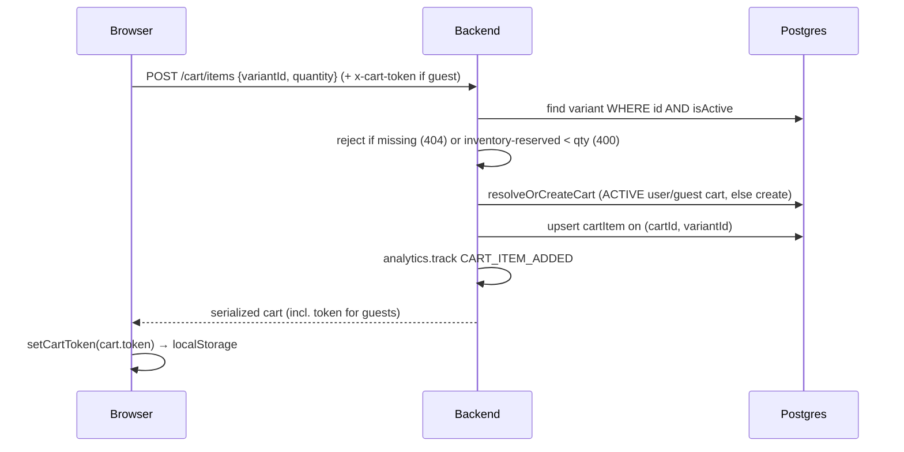
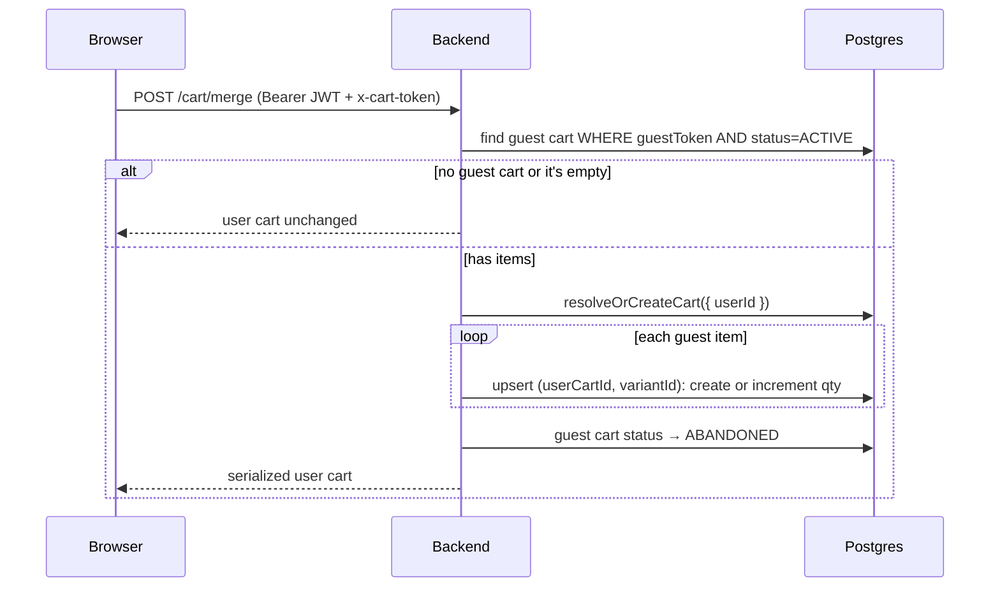
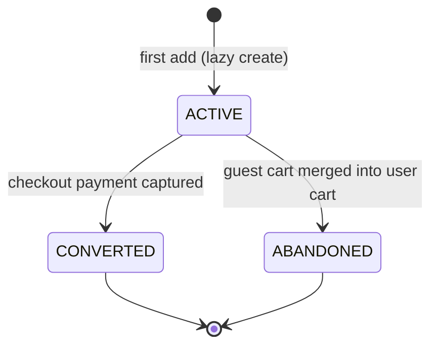

# Cart Flow

A cart is built incrementally before checkout, under a **dual-identity model**: an
authenticated customer's cart is keyed by `userId`, while an anonymous shopper's cart is keyed
by an **opaque guest token** carried in the `x-cart-token` header. The cart endpoints are
`@Public()` so guests and customers hit the same routes; the server picks the identity from the
bearer token if present, otherwise from the guest token. Carts are created **lazily** on the
first add, and a guest cart is **merged into the user cart** on sign-in.

Backend: [`backend/src/cart`](../backend/src/cart). Frontend:
[`frontend/src/hooks/use-cart.ts`](../frontend/src/hooks/use-cart.ts),
[`frontend/src/lib/cart-token.ts`](../frontend/src/lib/cart-token.ts),
[`frontend/src/lib/api.ts`](../frontend/src/lib/api.ts),
[`frontend/src/pages/store/cart-page.tsx`](../frontend/src/pages/store/cart-page.tsx).

## Identity model

Every cart request resolves to a `CartContext` of **either** a `userId` **or** a `guestToken`
([`cart.service.ts`](../backend/src/cart/cart.service.ts)). The controller builds it: if a valid
JWT is attached it uses `{ userId }` and **ignores** any guest token; otherwise it falls back to
`{ guestToken }` from the header ([`cart.controller.ts`](../backend/src/cart/cart.controller.ts)).

| Identity | Key | Where the key lives | How it travels |
| --- | --- | --- | --- |
| **Customer** | `Cart.userId` | server-side (the user account) | `Authorization: Bearer` JWT |
| **Guest** | `Cart.guestToken` | `localStorage['acme_cart_token']` | `x-cart-token` header |

- The guest token is an opaque CSPRNG value (`generateOpaqueToken(24)`), minted server-side when
  a guest's first item creates a cart, and returned to the client as `token` in the serialized
  cart.
- The frontend persists it in `localStorage` ([`cart-token.ts`](../frontend/src/lib/cart-token.ts),
  key `acme_cart_token`) and an axios **request interceptor** attaches it as `x-cart-token` on
  every request ([`api.ts`](../frontend/src/lib/api.ts)). The `useCart` query and all mutations
  call `setCartToken` whenever a response carries a `token`, keeping storage in sync.

## Endpoints

All routes are `@Public()` ([`cart.controller.ts`](../backend/src/cart/cart.controller.ts)).
Each accepts an optional `x-cart-token` header (except `merge`, which requires auth).

| Method | Path | Purpose | Service method |
| --- | --- | --- | --- |
| `GET` | `/cart` | Fetch the active cart (or `null`) | `getCart` |
| `POST` | `/cart/items` | Add a variant / increment its quantity | `addItem` |
| `PATCH` | `/cart/items/:id` | Set a line's quantity (`0` deletes) | `updateItem` |
| `DELETE` | `/cart/items/:id` | Remove a line | `removeItem` |
| `POST` | `/cart/merge` | Fold a guest cart into the user cart (**requires auth**) | `mergeGuestCartIntoUser` |

The DTOs ([`cart.dto.ts`](../backend/src/cart/dto/cart.dto.ts)) validate input: `AddCartItemDto`
requires a UUID `variantId` and integer `quantity >= 1`; `UpdateCartItemDto` requires integer
`quantity >= 0` (0 is the delete sentinel). `:id` params are `ParseUUIDPipe`-validated.

## Lazy creation & add-to-cart

A cart row does not exist until the first add. `addItem` validates the variant and stock, then
`resolveOrCreateCart` returns the existing `ACTIVE` cart or **creates** one — `{ userId }` for a
customer, `{ guestToken }` for a guest (minting a token if none was supplied).



Add-to-cart steps ([`cart.service.ts`](../backend/src/cart/cart.service.ts), `addItem`):

1. **Variant must be active** — `findFirst WHERE id = variantId AND isActive = true`; otherwise
   `404 Product variant not found`.
2. **Availability check** — `inventoryQuantity - reservedQuantity < quantity` rejects with
   `400 Not enough inventory available`. See [Availability vs reservation](#availability-vs-reservation).
3. **Resolve or create the cart** for the current identity.
4. **Upsert the line** on the unique `(cartId, variantId)` pair — create with the requested
   quantity, or `increment` an existing line by that quantity. Either way `unitAmount` is set
   from the variant's current `priceAmount` (the line snapshots the price at add time).
5. **Track** a `CART_ITEM_ADDED` analytics event (with `userId`/`anonymousId`, product, variant,
   quantity).
6. Return the re-serialized cart.

## Quantity semantics

| Operation | Behavior |
| --- | --- |
| Add an existing variant | Quantity is **incremented** (upsert `update` branch). |
| `PATCH .../:id` with `quantity > 0` | Quantity is **set** to the absolute value. |
| `PATCH .../:id` with `quantity = 0` | The line is **deleted**. |
| `DELETE .../:id` | The line is **deleted** (`deleteMany` scoped to the cart). |

`updateItem` and `removeItem` first `requireActiveCart` (404 if none) and scope the item lookup
to that cart, so one shopper can't mutate another's line by id. The cart UI
([`cart-page.tsx`](../frontend/src/pages/store/cart-page.tsx)) drives quantity with +/- buttons
(floored at 1) and a remove button, each calling the corresponding mutation.

## Availability vs reservation

Add-to-cart's stock check is **advisory**: `available = inventoryQuantity - reservedQuantity`.
The same figure is surfaced per line as `availableQuantity` in the serialized cart. It exists to
give shoppers early feedback, but it is **not** the authoritative oversell guard — nothing is
held when an item is added to a cart.

The real guard runs at **checkout**, where stock is reserved atomically with a conditional
`reservedQuantity += qty WHERE inventoryQuantity - reservedQuantity >= qty`; if it affects zero
rows the checkout transaction rolls back. Two guests can each add the last unit to their carts;
only the first to check out wins. Reservation lifecycle and capture details live in
[`checkout.md`](./checkout.md).

## Serialized cart shape

`serialize` ([`cart.service.ts`](../backend/src/cart/cart.service.ts)) is the response shape for
every cart endpoint. Items are ordered by `createdAt asc`; each joins the variant, its product,
and the product's first image.

```jsonc
{
  "id": "cart-uuid",
  "token": "<guestToken or null for a user cart>",
  "currency": "usd",
  "items": [
    {
      "id": "cartItem-uuid",
      "variantId": "variant-uuid",
      "quantity": 2,
      "unitAmount": 4500,          // snapshot price (minor units)
      "lineTotal": 9000,           // unitAmount * quantity
      "name": "Product name",
      "variantName": "Variant name",
      "sku": "SKU-123",
      "imageUrl": "https://… or null",
      "availableQuantity": 7       // inventoryQuantity - reservedQuantity
    }
  ],
  "subtotal": 9000,                // Σ lineTotal
  "itemCount": 2                   // Σ quantity
}
```

- `token` is the cart's `guestToken` — non-null for guest carts (the client persists it), `null`
  for user carts.
- `GET /cart` returns `null` when no `ACTIVE` cart exists for the identity.

## Guest → user cart merge

When a guest signs in, their cart is folded into the user's cart so nothing is lost. This happens
two ways:

- **Credential login** — `AuthService` calls `mergeGuestCartIntoUser` during `POST /auth/login`,
  reading the guest token from the request (see [`auth.md`](./auth.md)).
- **After OAuth** — the Google redirect can't carry the `x-cart-token` header, so the frontend
  calls `POST /cart/merge` once the session is restored on `/auth/callback`. The route 401s if
  unauthenticated and is a no-op if no guest token is present.



Merge details (`mergeGuestCartIntoUser`):

- Lines are **upserted** onto the user cart by `(cartId, variantId)` — overlapping variants have
  their quantities summed; the guest line's `unitAmount` is used when creating a new line.
- The guest cart is marked `ABANDONED` so it is never resolved again. The user cart becomes the
  single source of truth.
- An empty/absent guest cart is a no-op.

## Cart status lifecycle



| Status | Meaning | Set by |
| --- | --- | --- |
| `ACTIVE` | The live cart; the only status `findActiveCart` ever resolves. | Creation (default) |
| `CONVERTED` | Cart turned into a paid order. | Checkout webhook capture ([`checkout.md`](./checkout.md)) |
| `ABANDONED` | Guest cart whose items were folded into a user cart. | `mergeGuestCartIntoUser` |

All cart lookups (`findActiveCart`) filter on `status = ACTIVE`, so a `CONVERTED` or `ABANDONED`
cart is invisible and a fresh `ACTIVE` cart is created on the next add.

## Frontend data flow

- `useCart` ([`use-cart.ts`](../frontend/src/hooks/use-cart.ts)) queries `GET /cart` under the
  `['cart']` key and calls `setCartToken(data.token)` on every fetch.
- `useCartMutations` exposes `addItem` / `updateItem` / `removeItem`; each writes the returned
  cart straight into the query cache (`setQueryData`) and re-syncs the token — no refetch needed.
- The request interceptor in [`api.ts`](../frontend/src/lib/api.ts) attaches `x-cart-token` from
  `localStorage` and the bearer token (if any) on every call, so the same code path serves guests
  and customers.

## Related

- Reservation, payment capture, and `ACTIVE → CONVERTED` transition → [`checkout.md`](./checkout.md).
- Session model and where the guest-cart merge is triggered on login/OAuth → [`auth.md`](./auth.md).
