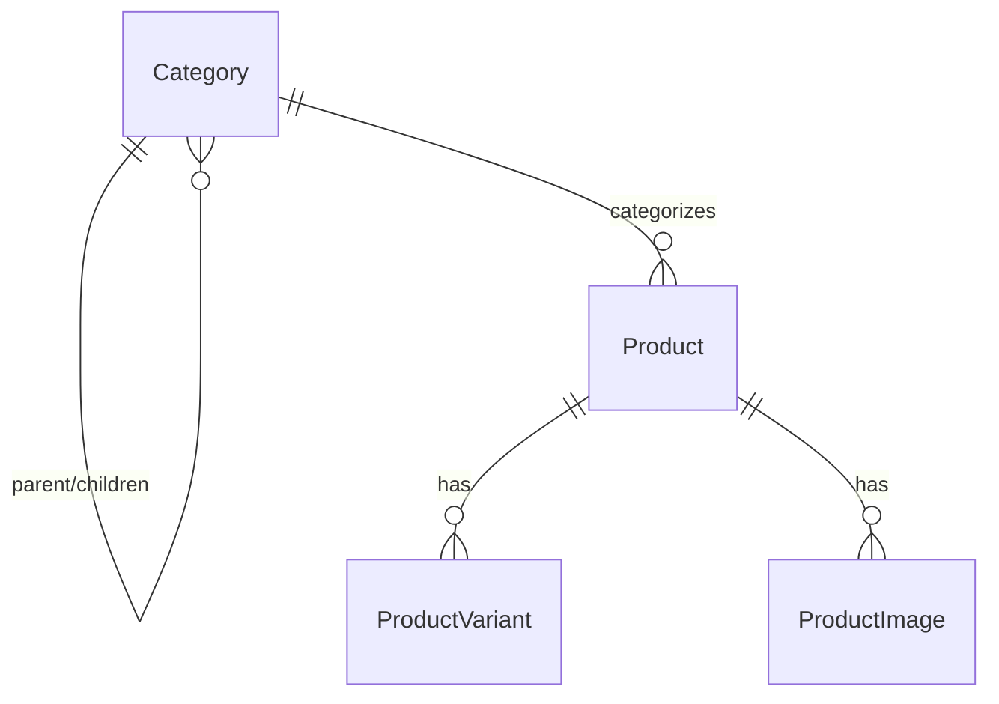
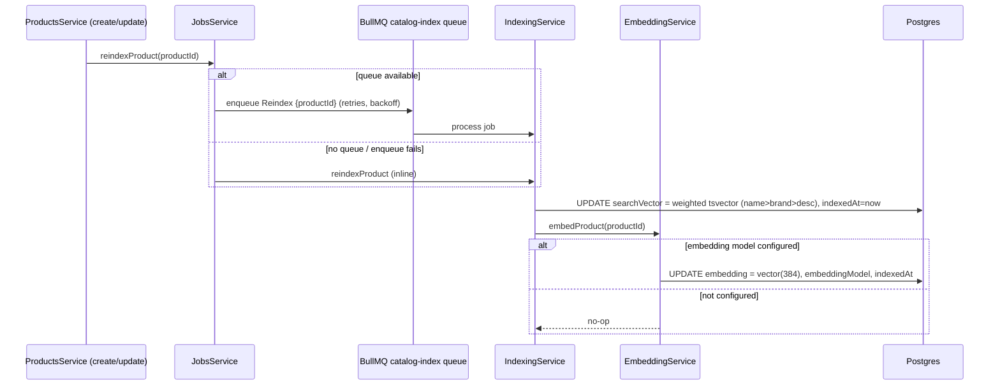

# Catalog

The catalog is the read/write core of the store: a hierarchical **category tree**, **products**
that carry their sellable **variants** (price / SKU / inventory) and ordered **images**, and a
**retrieval layer** (`searchVector` for keyword search, `embedding` for semantic search) that is
rebuilt on every write. Admins author products and categories; the storefront browses the active
subset and searches it.

Backend: [`backend/src/categories`](../backend/src/categories),
[`backend/src/products`](../backend/src/products),
[`backend/src/jobs/indexing.service.ts`](../backend/src/jobs/indexing.service.ts),
[`backend/src/ai/embedding.service.ts`](../backend/src/ai/embedding.service.ts). Frontend:
[`frontend/src/hooks/use-catalog.ts`](../frontend/src/hooks/use-catalog.ts),
[`frontend/src/pages/store/home-page.tsx`](../frontend/src/pages/store/home-page.tsx),
[`frontend/src/pages/admin/product-form-page.tsx`](../frontend/src/pages/admin/product-form-page.tsx).

## Data model

| Model | Key fields | Notes |
| --- | --- | --- |
| `Category` | `name`, `slug` (unique), `parentId`, `position`, `isActive`, `deletedAt` | Self-referential tree (`CategoryTree`); `onDelete: SetNull` so removing a parent orphans, not deletes, children. |
| `Product` | `name`, `slug` (unique), `status`, `categoryId`, `brand`, `attributes` (JSON), `publishedAt`, `searchVector`, `embedding`, `deletedAt` | `category` is `onDelete: SetNull`. Soft-deleted via `deletedAt`. |
| `ProductVariant` | `sku` (unique), `name`, `priceAmount`, `compareAtAmount`, `currency`, `inventoryQuantity`, `reservedQuantity`, `options` (JSON), `isActive` | The sellable unit. **Money is integer minor units** (cents). Stock = `inventoryQuantity - reservedQuantity`. |
| `ProductImage` | `url`, `alt`, `position` | Ordered by `position`; `onDelete: Cascade`. |

`ProductStatus` is `DRAFT` (default) → `ACTIVE` → `ARCHIVED`
([`schema.prisma`](../backend/prisma/schema.prisma)). Retrieval columns:
`searchVector Unsupported("tsvector")` with a **GIN index**, and
`embedding Unsupported("vector(384)")` (pgvector) plus `embeddingModel` / `indexedAt`. Prisma can't
type these, so they are written through raw SQL by the indexing/embedding services.

## Category tree

`CategoriesService` ([`categories.service.ts`](../backend/src/categories/categories.service.ts))
exposes two read shapes plus admin CRUD:

- **`findActiveTree()`** (storefront) — loads `deletedAt: null AND isActive: true`, ordered by
  `position` then `name`, and assembles a nested tree with `buildTree`. `buildTree` buckets rows by
  `parentId` once and recursively attaches `children` starting from the roots (`parentId = null`) —
  a single query, no N+1.
- **`findAllForAdmin()`** — flat list of all non-deleted categories with a `_count.products`.
- **`create` / `update`** — `slug` is derived from `name` via `toSlug` (re-derived whenever `name`
  changes on update). `update` translates `parentId` into a Prisma `connect`/`disconnect` (passing
  `null` detaches the parent).
- **`remove`** — **soft delete**: sets `deletedAt` and `isActive = false` (returns
  `"Category archived"`); the row stays for referential integrity but drops out of every query.

| Route | Auth | Handler |
| --- | --- | --- |
| `GET /categories` | `@Public()` | `findActiveTree` — nested active tree |
| `GET /admin/categories` | `ADMIN` | `findAllForAdmin` |
| `POST /admin/categories` | `ADMIN` | `create` |
| `PATCH /admin/categories/:id` | `ADMIN` | `update` |
| `DELETE /admin/categories/:id` | `ADMIN` | `remove` (soft delete) |

([`categories.controller.ts`](../backend/src/categories/categories.controller.ts),
[`category.dto.ts`](../backend/src/categories/dto/category.dto.ts))

## Products: admin authoring

`ProductsService` ([`products.service.ts`](../backend/src/products/products.service.ts)) owns the
write path. Both create and update finish by **enqueuing a reindex** (see below).

### Create

`create(dto)` writes the product and its nested children in one Prisma `create`:

- `slug` via `toUniqueSlug(dto.name)`; `status` defaults to `DRAFT`; `publishedAt` is set to *now*
  only when `status === ACTIVE`.
- `variants: { create: ... }` — each mapped through `toVariantCreate` (defaults `inventoryQuantity`
  to 0, `isActive` to true, `options` to `{}`).
- `images: { create: ... }` — `position` defaults to array index when omitted.
- Then `await this.jobs.reindexProduct(product.id)`.

`CreateProductDto` requires a non-empty `variants` array; `images` is optional. Variant
`priceAmount` / `compareAtAmount` / `inventoryQuantity` are validated as integers `>= 0`
([`product.dto.ts`](../backend/src/products/dto/product.dto.ts)) — the admin form sends cents
(`Math.round(price * 100)`).

### Update — transactional variant/image sync

`update(id, dto)` runs inside `prisma.$transaction` so scalar edits and child reconciliation commit
atomically:

1. Update product scalars (`name`, `description`, `status`, `brand`, `attributes`, `categoryId`;
   `publishedAt = now` when transitioning to `ACTIVE`).
2. **`syncVariants`** (only if `dto.variants` provided) — diff by `id`: delete variants whose `id`
   isn't in the incoming set (`deleteMany ... id notIn keepIds`; if none kept, delete all), then
   **update** rows that carry an `id` and **create** rows that don't. This preserves variant ids
   (and their FK references from cart/order items) across edits.
3. **`syncImages`** (only if `dto.images` provided) — full replace: `deleteMany` then `createMany`
   with `position` defaulting to index.
4. Re-read with `PRODUCT_INCLUDE`, commit, then `await this.jobs.reindexProduct(id)`.

### Remove

`remove(id)` is a **soft delete / archive**: sets `deletedAt` and `status = ARCHIVED` (returns
`"Product archived"`). Archived products are excluded from all storefront and admin list queries
(which filter `deletedAt: null`).

| Route | Auth | Handler |
| --- | --- | --- |
| `GET /products` | `@Public()` | `findManyForStorefront` (search + pagination) |
| `GET /products/:slug` | `@Public()` | `findBySlug` (ACTIVE only) |
| `GET /admin/products` | `ADMIN` | `findManyForAdmin` |
| `GET /admin/products/:id` | `ADMIN` | `findOneForAdmin` |
| `POST /admin/products` | `ADMIN` | `create` |
| `PATCH /admin/products/:id` | `ADMIN` | `update` |
| `DELETE /admin/products/:id` | `ADMIN` | `remove` (archive) |
| `POST /admin/catalog/reindex` | `ADMIN` | `IndexingService.reindexAll` (backfill) |

([`products.controller.ts`](../backend/src/products/products.controller.ts))

The admin form ([`product-form-page.tsx`](../frontend/src/pages/admin/product-form-page.tsx))
edits details, a repeatable variant list (SKU / name / price / inventory), images, status, and
category in one screen; existing variants keep their `id` so the submit feeds `syncVariants`
in-place. Prices are entered in dollars and converted to integer cents on submit.

## Storefront browsing & search

`findManyForStorefront(query)` branches on whether a search term is present:

- **No search term** → `runPaginatedQuery` over `deletedAt: null AND status: ACTIVE`
  (optionally `categoryId`), ordered by `createdAt desc`, paginated. This is the default catalog
  grid and the category-chip filter.
- **Search term present** → `searchStorefront` (full-text path).

`findBySlug` returns a single product only when it's `ACTIVE` and not deleted (404 otherwise), with
images ordered by `position` and variants by `createdAt`.

### Keyword (full-text) search

`searchStorefront` queries the maintained `searchVector` directly via raw SQL
([`products.service.ts`](../backend/src/products/products.service.ts)):

- Builds a tsquery with `websearch_to_tsquery('english', term)` (so user phrases / operators are
  parsed safely) and matches `searchVector @@ tsquery` against `ACTIVE`, non-deleted rows, plus an
  optional `categoryId` filter.
- Orders by `ts_rank("searchVector", tsquery) DESC, "createdAt" DESC`, applies `LIMIT/OFFSET`, and a
  separate `count(*)` drives pagination meta.
- Ranked **ids** are then hydrated through Prisma (`findMany ... id in [...]`) and re-ordered to
  match the rank order, so results keep the standard `PRODUCT_INCLUDE` shape and types. No matches →
  an empty page.

### Pagination

All list endpoints use `PaginationQueryDto` (`page` default 1, `pageSize` default 20, max 100) and
return `{ data, meta: { page, pageSize, total, totalPages } }` via `paginate()`
([`pagination.dto.ts`](../backend/src/common/dto/pagination.dto.ts)). The storefront grid reads
`meta.totalPages` to render its pager
([`home-page.tsx`](../frontend/src/pages/store/home-page.tsx)).

### Semantic (AI) search

The keyword path above is exact-match relevance. A separate **semantic** path uses the product
`embedding` vector for meaning-based retrieval and is only active when an embedding model is
configured. See [`ai.md`](./ai.md) for vector search and recommendations.

## Index-on-write

The retrieval columns are derived data; they are rebuilt every time a product changes. Writes
enqueue a reindex through `JobsService`, which dispatches to the BullMQ catalog-index queue when
available and otherwise **runs inline** (so the index never silently goes stale)
([`jobs.service.ts`](../backend/src/jobs/jobs.service.ts),
[`catalog-index.processor.ts`](../backend/src/jobs/processors/catalog-index.processor.ts)).

- **`searchVector` (always)** — `IndexingService.updateSearchVector`
  ([`indexing.service.ts`](../backend/src/jobs/indexing.service.ts)) recomputes a **weighted**
  tsvector: `setweight(name,'A') || setweight(brand,'B') || setweight(description,'C')`, so a name
  hit outranks a brand hit outranks a description hit. Maintained on every create/update; the GIN
  index makes the `@@` lookup fast.
- **`embedding` (when AI configured)** — `EmbeddingService.embedProduct`
  ([`embedding.service.ts`](../backend/src/ai/embedding.service.ts)) is a no-op unless
  `provider.isConfigured()`. When enabled it builds a text blob (name, brand, category name,
  description, attributes), calls the embedding provider, and writes the resulting
  `vector(384)` + `embeddingModel` via raw SQL. Generation failures are logged and swallowed — they
  never fail the product write.

### Backfill / reindex endpoint

`POST /admin/catalog/reindex` calls `IndexingService.reindexAll`: it recomputes `searchVector` for
**all** non-deleted products in one `UPDATE`, and — only if embeddings are enabled — iterates every
product to (re)generate its embedding. Returns `{ reindexed: <count> }`. Use it after bulk imports,
after enabling/changing the embedding model, or to repair drift.

## Soft-delete & status semantics

| State | `deletedAt` | `status` / `isActive` | Visible to storefront? | Visible to admin? |
| --- | --- | --- | --- | --- |
| Product DRAFT | null | `DRAFT` | No (storefront requires `ACTIVE`) | Yes |
| Product ACTIVE | null | `ACTIVE` | Yes | Yes |
| Product archived | set | `ARCHIVED` | No | No (filtered by `deletedAt: null`) |
| Category active | null | `isActive: true` | Yes (in tree) | Yes |
| Category hidden | null | `isActive: false` | No | Yes |
| Category archived | set | `isActive: false` | No | No |

Deletes are never hard — rows persist so existing cart items, order items, and FK references stay
valid; the records simply drop out of every active query.

## Related

- Semantic vector search, embeddings, and recommendations → [`ai.md`](./ai.md).
- How variant `inventoryQuantity` / `reservedQuantity` is reserved and sold → [`checkout.md`](./checkout.md).
