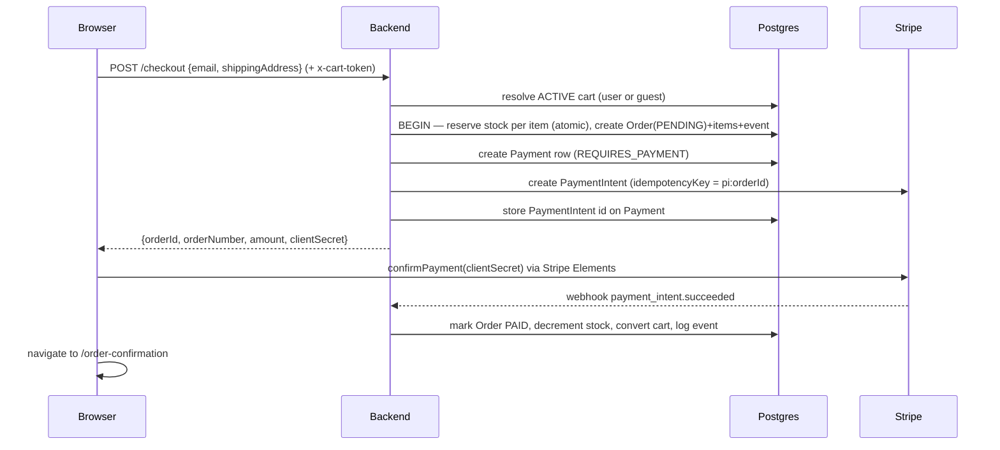
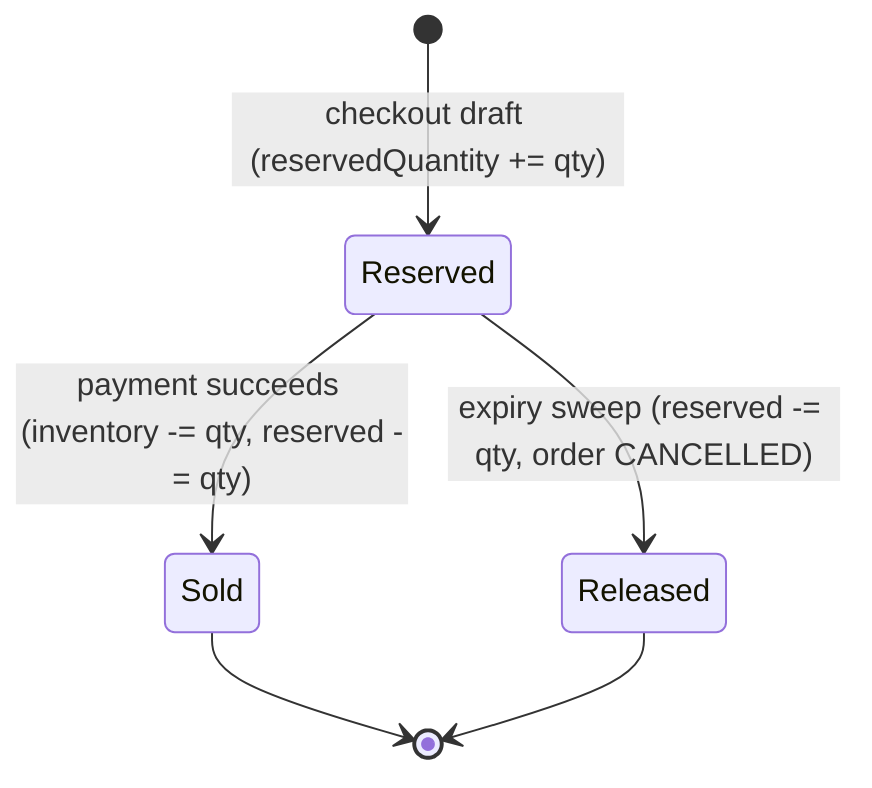

# Checkout Flow

Turns an active cart into a paid order via Stripe, with **atomic stock reservation**,
**idempotency per cart**, and **exactly-once** payment capture. It degrades gracefully when
Stripe isn't configured (a demo completion keeps the flow exercisable).

Backend: [`backend/src/checkout`](../backend/src/checkout),
[`backend/src/orders/orders.service.ts`](../backend/src/orders/orders.service.ts),
[`backend/src/stripe`](../backend/src/stripe). Frontend:
[`frontend/src/pages/store/checkout-page.tsx`](../frontend/src/pages/store/checkout-page.tsx).

## Happy path



## Step by step

1. **Resolve the cart** (`CheckoutService.resolveCart`) — by `userId` for an authenticated
   customer, otherwise by the `x-cart-token` guest token. If neither is present, or the cart
   is empty, the request is rejected (`400`). This guard prevents a token-less request from
   matching an arbitrary cart.

2. **Idempotency check** — an order is unique per cart (`Order.cartId` unique). If one already
   exists, checkout **resumes** it instead of creating a duplicate (returns the same order +
   client secret). A paid order is rejected ("already paid").

3. **Draft + reservation** (`OrdersService.createDraftFromCart`, one transaction):
   - Snapshot each cart item into an `OrderItem` (`productName`, `variantName`, `sku`,
     `unitAmount`, `quantity`) so the order is immutable against future catalog edits.
   - **Reserve stock atomically** per variant with a conditional update —
     `reservedQuantity += qty WHERE inventoryQuantity - reservedQuantity >= qty`. If it
     affects 0 rows, stock is insufficient and the whole transaction rolls back (`400` out of
     stock). This is the real oversell guard.
   - Create the `Order` (`PENDING` / `REQUIRES_PAYMENT`) with totals (currently
     `total = subtotal`; tax/shipping fields exist but are 0) and an `ORDER_CREATED` event.

4. **Payment intent** (`CheckoutService.attachPaymentIntent`) — a `Payment` row is created
   first (so a Stripe failure can't strand the order), then:
   - **Stripe configured** → create a PaymentIntent with idempotency key `pi:<orderId>`,
     store its id on the payment, return its `client_secret`.
   - **Stripe not configured** → return `clientSecret: null`; the storefront runs a demo
     completion so checkout stays clickable without keys.

5. **Pay on the client** — the storefront renders Stripe Elements with the `client_secret`
   and calls `confirmPayment(..., { redirect: 'if_required' })`. On success it clears the
   cart token, invalidates the cart query, and routes to the confirmation page.

6. **Confirm server-side via webhook** (next section) — the order is only marked paid by the
   webhook, never by the client.

## Webhook & payment capture

`POST /checkout/webhook` verifies the Stripe signature against the **raw** request body
(`rawBody: true` in `main.ts`) and dispatches through `handleStripeEvent`:

```mermaid
sequenceDiagram
  participant S as Stripe
  participant API as Backend
  participant DB as Postgres
  S-->>API: payment_intent.succeeded
  API->>DB: seen this event id before? (webhook_events) — if yes, skip
  API->>DB: UPDATE order SET PAID WHERE paymentStatus<>SUCCEEDED AND status<>CANCELLED
  alt updated 1 row (first time)
    API->>DB: payment SUCCEEDED; decrement inventory & release reservation; cart CONVERTED; log event
    API->>API: track ORDER_PLACED
  else updated 0 rows (duplicate / cancelled)
    API->>DB: no-op
  end
  API->>DB: record webhook event id
```

- **Exactly-once**: capture is a single conditional `updateMany`; only the first delivery
  transitions the order and runs side effects. Duplicate deliveries no-op.
- **Dedup ledger**: `webhook_events` (unique `provider+eventId`) short-circuits repeats;
  processing happens before recording, so a crash just yields a safe Stripe retry.
- **Stock conversion**: on capture, `inventoryQuantity -= qty` and `reservedQuantity -= qty`
  (clamped at 0) — the hold becomes a real sale.
- **`payment_intent.payment_failed`** → `markPaymentFailed` flips the payment/order to
  `FAILED` (guarded against out-of-order delivery); the reservation is left for the expiry
  sweep.

## Inventory reservation lifecycle



Available stock shown to shoppers is always `inventoryQuantity - reservedQuantity`
(`CartService` and add-to-cart validation use this).

## Stale order expiry

A scheduled sweep (`OrderMaintenanceScheduler`, every 5 min) cancels orders still
`PENDING`/`REQUIRES_PAYMENT` past `ORDER_RESERVATION_TTL_MINUTES` (default 30):

- mark `CANCELLED`, set `cancelledAt`, **detach the cart** (`cartId = null`) so the shopper
  can check out again,
- **release** the reservation (`reservedQuantity -= qty`),
- log an `ORDER_EXPIRED` event,
- **cancel the Stripe PaymentIntent** so a late confirmation can't capture funds against a
  dead order.

## Idempotency & failure handling

| Scenario | Behavior |
| --- | --- |
| Double-submit / refresh | Same cart → same order resumed (no duplicate order/charge). |
| Concurrent first checkout | Loser hits the `cartId` unique constraint (P2002) and resumes the winner's order. |
| Stripe PaymentIntent create fails | Payment row already exists; resume recreates the intent (idempotency key `pi:<orderId>`). |
| Duplicate `succeeded` webhook | Conditional update no-ops; dedup ledger short-circuits. |
| Out of stock at reservation | Transaction rolls back; `400`. |
| No Stripe keys (local dev) | `clientSecret: null` → storefront demo completion; order + reservation still created. |

## Related

- Order management after payment (status, refunds, returns) → [`orders.md`](./orders.md).
- Cart construction and guest→user merge → [`cart.md`](./cart.md).
