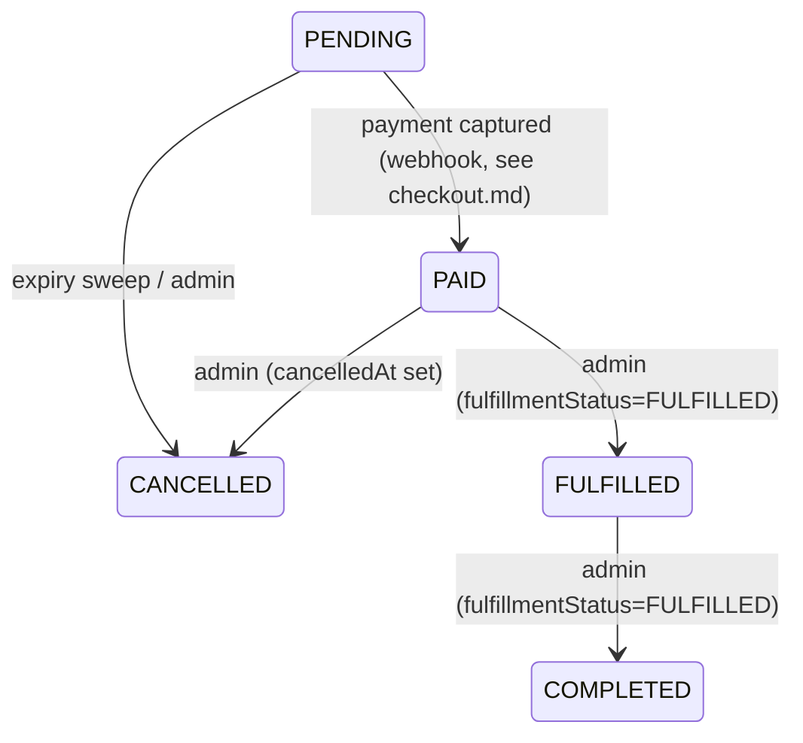

# Order Management (post-payment)

Everything that happens to an order **after** it is paid: admins list and inspect orders,
move them through the fulfillment lifecycle, issue full/partial refunds, and record returns.
The centerpiece is a **two-phase reserve-then-execute refund** that stays correct under
concurrent partial refunds (row lock + live-balance check) without holding a DB lock across
the Stripe call, backed by a **reconciliation sweep** that repairs refunds interrupted by a
crash. Every change appends to an order's **event timeline** and writes an **audit log**.

Backend: [`backend/src/orders/orders.service.ts`](../backend/src/orders/orders.service.ts),
[`backend/src/orders/orders.controller.ts`](../backend/src/orders/orders.controller.ts),
[`backend/src/orders/refund-reconciliation.scheduler.ts`](../backend/src/orders/refund-reconciliation.scheduler.ts),
[`backend/src/orders/order-maintenance.scheduler.ts`](../backend/src/orders/order-maintenance.scheduler.ts),
[`backend/src/stripe/stripe.service.ts`](../backend/src/stripe/stripe.service.ts). Order
creation and payment capture happen earlier — see [`checkout.md`](./checkout.md).

## Routes

All `admin/*` routes are `@Roles(Role.ADMIN)`; the customer routes are
`@Roles(Role.CUSTOMER, Role.ADMIN)` and scoped to the caller's own orders.

| Method & path | Handler | Who | Purpose |
| --- | --- | --- | --- |
| `GET /admin/orders` | `findManyForAdmin` | ADMIN | Paginated list, filter by `status` / `customerId` / `search` (order number) |
| `GET /admin/orders/:id` | `findOneForAdmin` | ADMIN | Full detail (items, payments, refunds, returns, events, customer) |
| `PATCH /admin/orders/:id/status` | `updateStatus` | ADMIN | Move order through the lifecycle |
| `POST /admin/orders/:id/refund` | `refund` | ADMIN | Full or partial refund (`amount?`, `reason?`) |
| `POST /admin/orders/:id/returns` | `createReturn` | ADMIN | Record an RMA against order items |
| `GET /orders` | `findManyForCustomer` | CUSTOMER/ADMIN | Caller's own order history |
| `GET /orders/:id` | `findOneForCustomer` | CUSTOMER/ADMIN | Caller's own order detail |

## List & detail (admin vs customer scoping)

- **Admin list** (`findManyForAdmin`) — builds a `where` from `status`, `customerId`, and a
  case-insensitive `orderNumber` `contains` search; runs `findMany` + `count` in one
  `$transaction` and returns a `paginate(...)` page. Each row includes the `customer`
  summary and an `_count` of items.
- **Admin detail** (`findOneForAdmin`) — loads the order with `ORDER_DETAIL_INCLUDE`:
  `items`, `payments`, `refunds`, `returns` (+ their items), `events` (newest first), and
  the `customer` summary. `404` if absent.
- **Customer scoping** — `findManyForCustomer` simply calls `findManyForAdmin` with
  `customerId` **forced** to the caller's `userId`, so a customer can never widen the filter
  to someone else's orders. `findOneForCustomer` uses `findFirst({ where: { id, customerId } })`
  (a foreign order id yields `404`, not a leak) and returns a **narrower** include
  (`items`, `refunds`, `returns`, `events`) — no `payments`, no other-customer PII.

## Status transitions

`PATCH /admin/orders/:id/status` (`updateStatus`) sets `OrderStatus` from
[`UpdateOrderStatusDto`](../backend/src/orders/dto/order.dto.ts) (`status`, optional `note`).
`OrderStatus` values: `PENDING`, `PAID`, `FULFILLED`, `COMPLETED`, `CANCELLED`.

The handler is deliberately thin — it does not enforce a state machine — but it derives two
side fields and records the change:

- **`fulfillmentStatus`** is set to `FULFILLED` when the new status is `FULFILLED` or
  `COMPLETED`; otherwise left untouched (`undefined`).
- **`cancelledAt`** is stamped with `new Date()` when the new status is `CANCELLED`.
- A `STATUS_CHANGED` **order event** is appended (`message` = the `note`, or
  `Status changed to <status>`; `data: { status }`).
- An **audit log** `order.status_changed` is written with the actor and `{ status }`.
- Returns the full order via `ORDER_DETAIL_INCLUDE`.



> Note: the `PENDING → PAID` edge is owned by the checkout webhook, not this route — see
> [`checkout.md`](./checkout.md). Refunds change `paymentStatus`, **not** `OrderStatus`.

## Refunds — two-phase reserve-then-execute

A naive refund (lock the order, call Stripe, commit) would hold a DB row lock across a
network call to Stripe. Instead `refund` splits into a **reserve** transaction and an
**execute** step, so concurrent refunds serialize on the lock briefly and then see the
updated balance — while the slow Stripe call runs with no lock held.

```mermaid
sequenceDiagram
  participant A as Admin
  participant API as OrdersService
  participant DB as Postgres
  participant S as Stripe
  A->>API: POST /admin/orders/:id/refund {amount?, reason?}
  rect rgb(235,245,255)
  note over API,DB: Phase 1 — reserveRefund (one transaction)
  API->>DB: SELECT refundedAmount,totalAmount,currency FROM orders WHERE id=:id FOR UPDATE
  API->>DB: find SUCCEEDED payment (needs providerRef)
  API->>API: amount = dto.amount ?? (total - refundedBefore); reject if <=0 or > remaining
  API->>DB: INSERT Refund(PENDING, idempotencyKey = refund:id:refundedBefore:amount)
  API->>DB: UPDATE orders SET refundedAmount += amount, paymentStatus = derived
  end
  rect rgb(235,255,235)
  note over API,S: Phase 2 — execute (no DB lock held)
  API->>S: refunds.create({payment_intent, amount, metadata.refundId}, {idempotencyKey})
  alt Stripe succeeds
    API->>DB: finalizeRefund — Refund SUCCEEDED + providerRef; event REFUND_ISSUED
    API->>DB: audit order.refunded {amount}
  else Stripe throws
    API->>DB: releaseRefund — refundedAmount -= amount; Refund FAILED + idempotencyKey=null; event REFUND_FAILED
    API-->>A: 400 "Refund failed at the payment provider"
  end
  end
```

### Phase 1 — `reserveRefund` (the lock + balance check)

1. `SELECT "refundedAmount","totalAmount","currency" FROM "orders" WHERE "id"=:id FOR UPDATE`
   — pessimistically locks the order row. Concurrent refunds on the same order **block here**
   until the first transaction commits, then read the already-bumped `refundedAmount`.
2. Require a `SUCCEEDED` payment with a `providerRef` (the Stripe PaymentIntent), else
   `400 No captured payment to refund`.
3. Compute `amount = dto.amount ?? (total - refundedBefore)` (default = full remaining).
   Reject if `amount <= 0` **or** `amount > total - refundedBefore` → `400 Invalid refund
   amount`. This is the over-refund guard, evaluated against the **live** locked balance.
4. Create a `Refund` row `PENDING` with a deterministic
   `idempotencyKey = refund:<orderId>:<refundedBefore>:<amount>`.
5. Bump `orders.refundedAmount` to `refundedBefore + amount` and set `paymentStatus` via
   `refundPaymentStatus` (below). Commit — the reservation is now durable before any Stripe
   call.

### Phase 2 — execute, then finalize or release

- **`finalizeRefund`** (success) — one transaction: flip the `Refund` to `SUCCEEDED` with the
  Stripe `providerRef`, and append a `REFUND_ISSUED` event (`Refunded <amount> <currency>`,
  `data: { amount, reason }`). The caller then audits `order.refunded`.
- **`releaseRefund`** (Stripe threw — compensation) — re-locks the order `FOR UPDATE`,
  subtracts `amount` back off `refundedAmount` (clamped at 0), recomputes `paymentStatus`,
  marks the `Refund` `FAILED`, and **nulls its `idempotencyKey`**. Appends `REFUND_FAILED`.
  Freeing the key matters: the column is `@unique`, so releasing it lets an identical retry
  (`refund:id:refundedBefore:amount`) be created again instead of colliding (P2002).

### `refundPaymentStatus` helper

Derives the order's `PaymentStatus` from the running refund total:

| Condition | `paymentStatus` |
| --- | --- |
| `refundedTotal <= 0` | `SUCCEEDED` (back to fully paid) |
| `0 < refundedTotal < total` | `PARTIALLY_REFUNDED` |
| `refundedTotal >= total` | `REFUNDED` |

### Stripe idempotency

`StripeService.refund` passes the reservation's `idempotencyKey` as Stripe's request
idempotency key and stamps `metadata.refundId` on the Stripe Refund. The key makes a retried
*create* a no-op at Stripe; the metadata lets reconciliation **match** a refund that already
exists rather than blindly re-issuing it.

## Refund reconciliation sweep

If the process crashes between Phase 1 (reservation committed) and Phase 2, a `Refund` is
stranded `PENDING` with `refundedAmount` already reserved. `reconcilePendingRefunds`
(swept by `RefundReconciliationScheduler`) repairs it without ever double-refunding.

```mermaid
sequenceDiagram
  participant Cron as RefundReconciliationScheduler
  participant API as OrdersService
  participant S as Stripe
  Cron->>API: reconcilePendingRefunds() (every 5 min)
  API->>API: load Refunds status=PENDING AND createdAt < now-2min
  loop each pending refund (needs payment.providerRef + idempotencyKey)
    API->>S: findRefundByMetadata(paymentIntent, refund.id)
    alt found & succeeded
      API->>API: finalizeRefund (record it; do NOT re-issue)
    else found & failed/canceled
      API->>API: releaseRefund (give the funds back)
    else not found
      API->>S: refunds.create(... same idempotencyKey ...)
      API->>API: finalizeRefund
    end
  end
```

- **Cadence**: `@Cron(EVERY_5_MINUTES)`; only refunds older than `olderThanMs` (default 2 min)
  are touched, so an in-flight Phase 2 isn't pre-empted. No-op when Stripe `isConfigured` is
  false.
- **Re-entrancy guard**: a `private running` boolean; an overlapping tick returns immediately
  so two sweeps never run at once. Errors per refund are caught and logged (`deferred`) — the
  next sweep retries.
- **Matching, not replay**: it identifies the real Stripe state via `findRefundByMetadata`
  (lists refunds on the PaymentIntent, matches `metadata.refundId`). A refund that already
  succeeded is *recorded*, not re-issued; a failed/canceled one is *released*; only a truly
  missing one is (idempotently) created.

## Returns / RMA

`POST /admin/orders/:id/returns` (`createReturn`) records a return request from
[`CreateReturnDto`](../backend/src/orders/dto/order.dto.ts) (`items[] = { orderItemId,
quantity>=1 }`, optional `reason`, `note`):

- Loads the order with its `items`; `404` if the order doesn't exist.
- **Validates ownership**: every `orderItemId` must belong to this order (checked against a
  `Set` of the order's item ids) — else `400 Return references an item not on this order`.
- Creates a `Return` (`status` defaults to `REQUESTED`) with nested `ReturnItem` rows.
- Appends a `RETURN_REQUESTED` event (`message` = `reason` or `Return requested`) and writes
  an audit log `order.return_requested` with `{ returnId }`.

A return is a **record only** — it does not itself move money or stock; an admin issues the
matching refund via the refund route.

## Order event timeline & audit log

Two append-only trails back this flow, with different audiences:

| | `OrderEvent` (`order_events`) | `AuditLog` (`audit_logs`) |
| --- | --- | --- |
| Scope | Per-order timeline (customer-facing activity feed) | Operational record of admin actions |
| Key fields | `orderId`, `type`, `message`, `data` | `actorId`, `action`, `entityType`, `entityId`, `data` |
| Written by | every lifecycle step | admin-initiated mutations |
| Actor | not attributed | `actorId` = the admin user |

Events emitted by this module: `STATUS_CHANGED`, `REFUND_ISSUED`, `REFUND_FAILED`,
`RETURN_REQUESTED` (plus `ORDER_CREATED` / `PAYMENT_SUCCEEDED` / `PAYMENT_FAILED` /
`ORDER_EXPIRED` from the checkout/maintenance side — see [`checkout.md`](./checkout.md)).
Audit actions: `order.status_changed`, `order.refunded`, `order.return_requested` (via the
private `audit(actorId, action, entityId, data)` helper, `entityType: 'order'`). Detail
queries return `events` newest-first.

## Concurrency & idempotency

| Scenario | Behavior |
| --- | --- |
| Concurrent partial refunds (same order) | Each `reserveRefund` takes `SELECT … FOR UPDATE`; the second blocks, then validates against the already-bumped `refundedAmount`. Their sum **can't exceed** `totalAmount` — the overflow one gets `400 Invalid refund amount`. |
| Refund Stripe call fails | `releaseRefund` compensates: `refundedAmount` restored, `Refund` → `FAILED`, **`idempotencyKey` nulled** so an identical retry doesn't collide; `400` to caller. |
| Crash between reserve and execute | Refund left `PENDING`; the 5-min sweep matches Stripe by `metadata.refundId` and finalizes (if it went through) or releases (if not) — never double-refunds. |
| Double-clicked refund (distinct reservations) | Each reservation lowers the remaining balance under the row lock, so a second full refund finds nothing refundable and is rejected. |
| Stripe retry of one `refunds.create` | Stripe request `idempotencyKey` makes the retried create a no-op at Stripe. |
| Overlapping reconciliation / maintenance ticks | `private running` guard in each scheduler drops the overlapping run. |
| Customer requests another customer's order | `customerId` is forced server-side; foreign id → `404`, no data leak. |

## Related

- Order creation, stock reservation, and payment capture (the webhook that sets `PAID`) →
  [`checkout.md`](./checkout.md).
- Roles/guards behind the `@Roles(Role.ADMIN)` routes → [`auth.md`](./auth.md).
