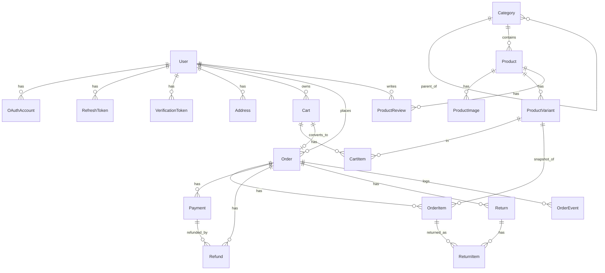

# Database Schema

The application uses **PostgreSQL** via **Prisma**. The source of truth is
[`backend/prisma/schema.prisma`](../backend/prisma/schema.prisma); this document is a
human-readable outline of it.

## Conventions

- **Identifiers** — every table has a `uuid` primary key (`id`).
- **Money** — all monetary values are **integer minor units** (cents), paired with an ISO
  `currency` string. There are no floats anywhere in the money path.
- **Soft deletes** — entities that must remain referenceable by historical records carry a
  nullable `deletedAt` (`User`, `Category`, `Product`). Queries filter `deletedAt IS NULL`.
- **`metadata` / `attributes`** — `Json` columns reserved as extension points (AI features,
  integrations, experiments) without requiring migrations.
- **Snapshots** — order line items copy product/variant data at purchase time so historical
  orders are immutable even if the catalog later changes.
- **Timestamps** — `createdAt` / `updatedAt` on mutable records.

## Postgres extensions

| Extension | Used for |
| --- | --- |
| `citext` | Case-insensitive email columns (`User.email`, `Order.email`). |
| `vector` (pgvector) | `Product.embedding` semantic-search vectors. |

Also note the non-Prisma-typed columns on `Product`: `searchVector` (`tsvector`, full-text
search, GIN-indexed) and `embedding` (`vector(384)`). Prisma represents these as
`Unsupported(...)`; they are read/written through raw SQL.

## Enums

| Enum | Values |
| --- | --- |
| `Role` | `GUEST`, `CUSTOMER`, `ADMIN` |
| `UserStatus` | `ACTIVE`, `INVITED`, `SUSPENDED`, `DEACTIVATED` |
| `AuthProvider` | `CREDENTIALS`, `GOOGLE` |
| `ProductStatus` | `DRAFT`, `ACTIVE`, `ARCHIVED` |
| `AddressType` | `SHIPPING`, `BILLING` |
| `CartStatus` | `ACTIVE`, `CONVERTED`, `ABANDONED` |
| `OrderStatus` | `PENDING`, `PAID`, `FULFILLED`, `COMPLETED`, `CANCELLED` |
| `PaymentStatus` | `REQUIRES_PAYMENT`, `PROCESSING`, `SUCCEEDED`, `FAILED`, `REFUNDED`, `PARTIALLY_REFUNDED` |
| `FulfillmentStatus` | `UNFULFILLED`, `PARTIALLY_FULFILLED`, `FULFILLED` |
| `RefundStatus` | `PENDING`, `SUCCEEDED`, `FAILED` |
| `ReturnStatus` | `REQUESTED`, `APPROVED`, `REJECTED`, `RECEIVED`, `REFUNDED` |
| `VerificationPurpose` | `EMAIL_VERIFICATION`, `PASSWORD_RESET` |
| `AnalyticsEventType` | `PRODUCT_VIEWED`, `PRODUCT_SEARCHED`, `CART_ITEM_ADDED`, `CHECKOUT_STARTED`, `ORDER_PLACED` |

## Relationship overview

---

## Identity & auth

### `users`
The auth principal and customer/admin record. A single table backs all roles.

| Field | Type | Notes |
| --- | --- | --- |
| `id` | uuid (PK) | |
| `email` | citext, unique | Case-insensitive. |
| `passwordHash` | string? | Null for OAuth-only accounts (argon2id when set). |
| `role` | `Role` | `CUSTOMER` by default; `ADMIN` for staff. `GUEST` is conceptual (unauthenticated). |
| `status` | `UserStatus` | `INVITED` until email verified; admin can `SUSPEND`/`DEACTIVATE`. |
| `firstName`, `lastName`, `phone`, `avatarUrl` | string? | Profile. |
| `emailVerifiedAt`, `lastLoginAt` | datetime? | |
| `metadata` | json | |
| `deletedAt` | datetime? | Soft delete. |

Relations: `oauthAccounts`, `refreshTokens`, `verificationTokens`, `addresses`, `carts`,
`orders`, `reviews`, `auditLogs` (as actor).
Indexes: `(role, status)`, `(deletedAt)`.

### `oauth_accounts`
Links a `User` to an external identity (e.g. Google). Unique on `(provider, providerAccountId)`.
Cascades on user delete.

### `refresh_tokens`
Long-lived **opaque** session tokens. Only the SHA-256 `tokenHash` is stored. Rotation is
tracked via `replacedById`; reuse of a revoked token revokes the lineage (theft detection).
Fields: `userAgent`, `ipAddress`, `expiresAt`, `revokedAt`. Cascades on user delete.

### `verification_tokens`
Single-use, expiring tokens (hashed). `purpose` is `EMAIL_VERIFICATION` or `PASSWORD_RESET`.
`consumedAt` marks redemption (consumption is atomic).

### `addresses`
Customer shipping/billing addresses (`type`, `isDefault`, name + lines + city/region/postal/country).
`SetNull` on user delete so the row can survive as historical reference.

---

## Catalog

### `categories`
Self-referencing tree (`parentId` → `children`) for departments → sub-categories.
Fields: `name`, unique `slug`, `description`, `imageUrl`, `position`, `isActive`, `metadata`,
soft `deletedAt`. Indexes: `(parentId)`, `(isActive)`.

### `products`
The sellable catalog entry. Pricing lives on variants, not here.

| Field | Type | Notes |
| --- | --- | --- |
| `id` | uuid (PK) | |
| `name`, `slug` (unique), `description`, `brand` | | `slug` carries a random suffix for uniqueness. |
| `status` | `ProductStatus` | `DRAFT` / `ACTIVE` / `ARCHIVED`. |
| `categoryId` | uuid? | `SetNull` on category delete. |
| `attributes` | json | Structured facets (color/material/…); feeds search & AI. |
| `metadata` | json | |
| `publishedAt` | datetime? | |
| `searchVector` | tsvector* | Full-text vector, maintained by the indexing worker. GIN-indexed. |
| `embedding` | vector(384)* | Semantic-search embedding (bge-small). |
| `embeddingModel`, `indexedAt` | | Provenance of the last index/embed. |
| `deletedAt` | datetime? | Soft delete (archives). |

\*Non-Prisma-typed columns, accessed via raw SQL.
Relations: `images`, `variants`, `reviews`. Indexes: `(status)`, `(categoryId)`, `(deletedAt)`,
GIN on `searchVector`.

### `product_images`
Ordered images per product (`url`, `alt`, `position`). Cascades on product delete.

### `product_variants`
The actual purchasable SKU (size/color/etc.).

| Field | Type | Notes |
| --- | --- | --- |
| `sku` | string, unique | |
| `name` | string | e.g. "Medium", "Black". |
| `priceAmount` | int | Minor units. |
| `compareAtAmount` | int? | Strike-through / sale reference. |
| `currency` | string | |
| `inventoryQuantity` | int | On-hand stock. |
| `reservedQuantity` | int | Held by unpaid orders; **available = inventory − reserved**. |
| `weightGrams`, `barcode` | | |
| `options` | json | e.g. `{ "size": "M" }`. |
| `isActive` | bool | |

Relations: `cartItems`, `orderItems`. Index: `(productId)`.

### `product_reviews`
Rating (`rating`) + optional `title`/`body` by a `User` (`SetNull` on author delete).
`metadata` reserved for AI moderation/sentiment.

---

## Cart & checkout

### `carts`
Belongs to **either** an authenticated `User` (`userId`) **or** an anonymous guest
(unique `guestToken`). `status` (`ACTIVE`/`CONVERTED`/`ABANDONED`), `currency`, `metadata`.
Has at most one `order` (1:1 via `Order.cartId`).

### `cart_items`
One row per variant in a cart. Unique on `(cartId, variantId)`. `quantity` and `unitAmount`
(price captured at add-to-cart, reconciled at checkout). `Restrict` on variant delete so a
referenced variant can't be hard-deleted out from under a cart.

---

## Orders, payments & fulfillment

### `orders`
The order aggregate. Three independent status axes:

| Field | Type | Notes |
| --- | --- | --- |
| `orderNumber` | string, unique | Human-friendly (`ORD-…`). |
| `customerId` | uuid? | `SetNull` — guest orders have none; `email` always set (citext). |
| `cartId` | uuid?, unique | Source cart (detached on expiry so the cart can be reused). |
| `status` | `OrderStatus` | Lifecycle: PENDING → PAID → FULFILLED → COMPLETED (or CANCELLED). |
| `paymentStatus` | `PaymentStatus` | |
| `fulfillmentStatus` | `FulfillmentStatus` | |
| `subtotalAmount`, `discountAmount`, `taxAmount`, `shippingAmount`, `totalAmount`, `refundedAmount` | int | All minor units. |
| `shippingAddress`, `billingAddress` | json? | Snapshotted at checkout. |
| `customerNote`, `metadata` | | |
| `placedAt`, `cancelledAt` | datetime? | |

Relations: `items`, `payments`, `refunds`, `returns`, `events`.
Indexes: `(customerId)`, `(status)`, `(paymentStatus)`, `(createdAt)`.

### `order_items`
Immutable line snapshot: `productName`, `variantName`, `sku`, `unitAmount`, `quantity`,
`totalAmount`. Keeps a nullable `variantId` link (`SetNull`) for analytics without coupling
the historical record to the live catalog.

### `payments`
A payment attempt against an order. `provider` (default `stripe`), unique `providerRef`
(Stripe PaymentIntent id), `status` (`PaymentStatus`), `amount`, `currency`. One order may
have several (e.g. retries). Cascades on order delete.

### `refunds`
A refund against a payment/order. `amount`, `reason`, `status` (`RefundStatus`), unique
`providerRef` (Stripe refund id) and unique `idempotencyKey` (guards retries; freed on
failure). Indexes: `(orderId)`, `(status)`.

### `returns` / `return_items`
A return request (`status` of `ReturnStatus`, `reason`, `note`) with per-line `return_items`
referencing `order_items` and a `quantity`. `Restrict` on the order item so a returned line
can't be deleted.

### `order_events`
Append-only per-order timeline (`type`, `message`, `data`). Powers the admin activity feed
and is a clean grounding source for AI agents. Cascades on order delete.

---

## Operational & AI signal

### `audit_logs`
Who-did-what for admin actions: `actor` (`User`, `SetNull`), `action`, `entityType`,
`entityId`, `data`. Indexes: `(entityType, entityId)`, `(actorId)`.

### `analytics_events`
Append-only **behavioral stream** — the signal source for recommendations/personalization.
Intentionally **decoupled** (scalar `userId`/`productId`/`variantId`, **no FKs**) so events
survive entity deletion and can be exported to a warehouse. `type` (`AnalyticsEventType`),
`anonymousId`, `sessionId`, `data`. Indexes: `(type, createdAt)`, `(userId)`, `(productId)`,
`(anonymousId)`.

### `webhook_events`
Dedup ledger for inbound provider webhooks. Unique `(provider, eventId)` makes processing of
an at-least-once delivery channel exactly-once.

---

## AI-readiness summary

The schema is built so AI features slot in without restructuring:

- `Product.embedding` (`vector(384)`) + the pgvector extension → semantic search & "you might
  also like" (the ANN index is applied via [`backend/prisma/sql/ai-indexes.sql`](../backend/prisma/sql/ai-indexes.sql)).
- `Product.searchVector` (`tsvector`, GIN) → ranked full-text retrieval / fallback.
- `analytics_events` → behavioral training/grounding signal.
- `order_events` + `audit_logs` → event history for agents and audits.
- `metadata` / `attributes` Json columns across entities → schema-free extension points.
